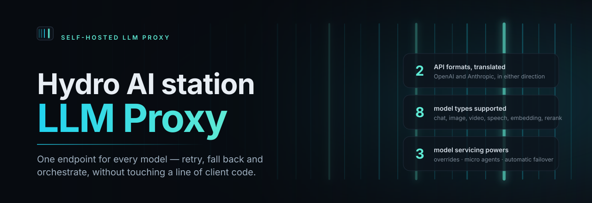
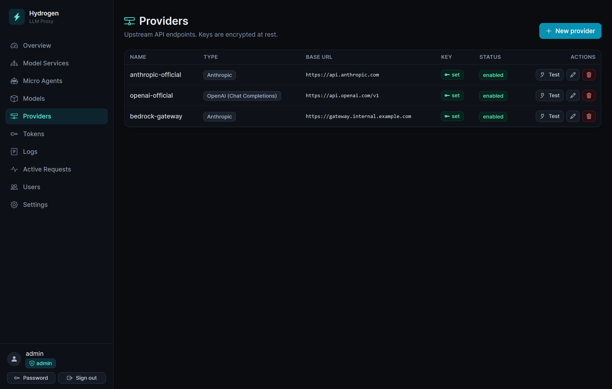
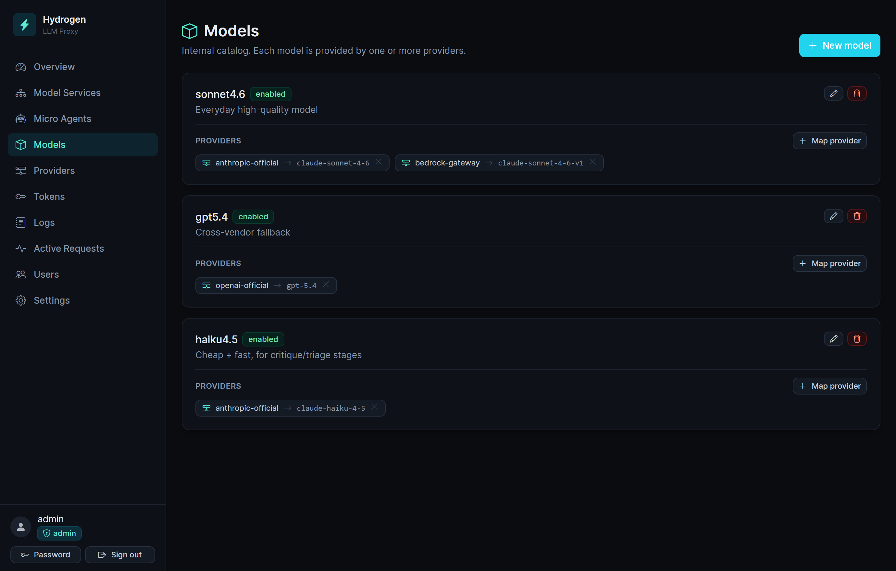
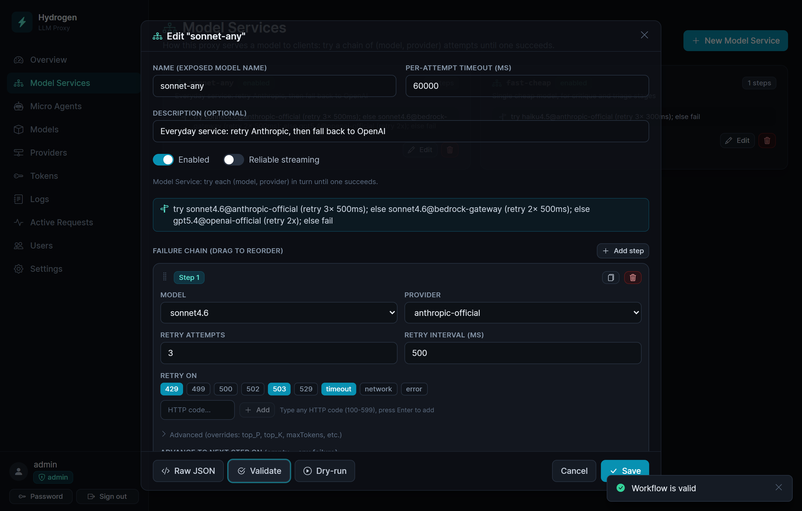
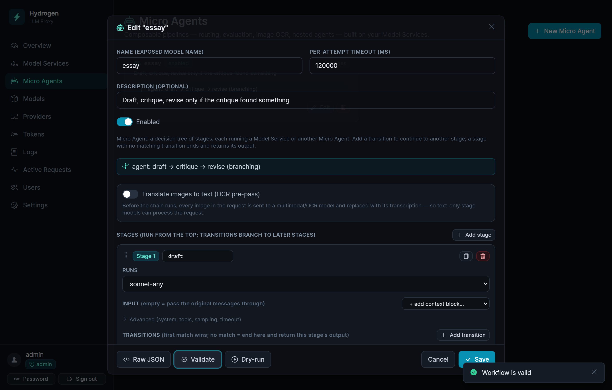

<div align="center">



<p>
  <a href="docs/getting-started.md"><b>Getting started</b></a> ·
  <a href="#deployment"><b>Deploy</b></a> ·
  <a href="#endpoints"><b>API</b></a> ·
  <a href="#configuration"><b>Configuration</b></a> ·
  <a href="https://github.com/Arrosam/Hydrogen-LLM-proxy/pkgs/container/hydrogen-llm-proxy"><b>Docker image</b></a> ·
  <a href="README.zh.md"><b>中文</b></a>
</p>

<p>
  <a href="https://github.com/Arrosam/Hydrogen-LLM-proxy/tags"></a>
  <a href="LICENSE"></a>
  <a href="https://github.com/Arrosam/Hydrogen-LLM-proxy/pkgs/container/hydrogen-llm-proxy"></a>
  <a href="https://github.com/Arrosam/Hydrogen-LLM-proxy/actions/workflows/docker-publish.yml"></a>
  <br>
  
  
  
  <a href="https://github.com/Arrosam/Hydrogen-LLM-proxy/stargazers"></a>
</p>

</div>

---

**Hydrogen** holds your provider API keys, and decides — per request — which model at which
provider actually serves it. Clients never name a real model: they name a **Model Service**, and
Hydrogen runs that service's ordered steps (retry → provider fallback → model fallback) over your
own catalogue. It speaks both the **OpenAI** and **Anthropic** wire formats and translates between
them, so an Anthropic-speaking client can be served by an OpenAI provider and never notice.

Everything is one container with SQLite inside. Provider keys are encrypted at rest, client keys are
hashed, and the whole instance — config, keys, users, logs — exports to a single passphrase-sealed file.

> **Micro Agents** — a stage pipeline (draft → critique → revise, routers, image OCR pre-pass)
> that clients call as if it were one model name. No client support required.
>
> **Beyond chat** — Model Services also cover image generation, video, text-to-speech,
> transcription, embeddings and rerank, with the same retry/fallback engine behind each one.
>
> **Deploy in one click** — published in the [Rainyun app store](#1-rainyun-app-store-one-click),
> or run the pre-built image anywhere Docker runs.

---

## How it fits together

```
Client request  (model = "sonnet-any")   ← only Model Services are exposed to clients
        │
   Model Service      ordered steps: try this, else that
        │
   Model              your internal name, e.g. "sonnet4.6"
        │
   Provider           base URL + encrypted API key
        │
   Upstream model id  what the provider calls it, e.g. "claude-sonnet-4-6"
```

Four concepts, each doing one job:

| Concept | What it is | Example |
|---|---|---|
| **Provider** | An upstream endpoint and its API key. | `openai-official`, `anthropic-official` |
| **Model** | Your internal name for a model. | `sonnet4.6` |
| **Mapping** | Which provider serves that model, under what id. | `sonnet4.6 → anthropic-official` as `claude-sonnet-4-6` |
| **Model Service** | The name clients request, and the rules behind it. | `sonnet-any` |

Each step of a Model Service pins one explicit **(model, provider)** pair, with its own retry count,
retry interval, and the failure classes that retry or advance. Provider fallback and model fallback
are both just "add another step". If every step is exhausted, the real upstream error goes back to
the client, translated into the client's own wire format.

| Model Service | Behaviour |
|---|---|
| `sonnet-any` | try `sonnet4.6 @ anthropic` → on failure fall back to `gpt5.4 @ openai` |
| `sonnet-persist` | try `sonnet4.6 @ anthropic`, retrying 5× at 1s intervals |
| `essay` (Micro Agent) | `draft` → `critique` → `revise`, returning the draft when the critique approves |

The payoff: swapping a provider, adding a fallback, capping a thinking budget or inserting a whole
agent pipeline is a dashboard edit. Client code keeps asking for `sonnet-any`.

---

## What you get

- **Two wire formats, translated both ways.** OpenAI Chat Completions, OpenAI Responses and
  Anthropic Messages — streaming and non-streaming, tool calls, images, and thinking blocks
  round-tripped rather than dropped.
- **Eight kinds of service.** `chat`, `ocr`, `image`, `video`, `tts`, `stt`, `embedding`, `rerank` —
  the non-chat ones are OpenAI-style passthroughs that still run your step chain.
- **Micro Agents.** Forward-only stage pipelines with conditions and routers. Each stage runs a saved
  Model Service, so every stage inherits that service's resilience. Nesting allowed, cycles rejected.
- **Per-step overrides.** Temperature, top-p/top-k, max tokens, stop sequences, thinking level, a
  system override, plus arbitrary extra body params — pinned per step, not per client.
- **Reliable streaming.** Buffer the upstream stream, treat a truncation as a retryable failure, and
  replay a complete response — or a clean 502, never half of one.
- **Image OCR with a cache.** A vision pre-pass transcribes images to text for downstream stages;
  descriptions are keyed by image hash and reused under an LRU byte budget.
- **API keys with teeth.** Scope a key to specific services, cap its requests and tokens, set an
  expiry, and let its holder check its own status on the public **Key Check** page.
- **Observability.** Every request logged with each attempt, payloads, latency and token usage —
  agent stages nested under the client request — plus live **Active Requests** and dashboard stats.
- **Backup & restore.** The whole instance in one passphrase-sealed file that restores onto any
  other Hydrogen.
- **Two roles, two languages.** admin / manager, dashboard in English or 中文.
- **Safe by default.** AES-256-GCM for provider keys, argon2id for passwords, SHA-256 for client
  keys, an SSRF guard on provider base URLs, and a boot-time master-key sentinel.

<table>
  <tr>
    <td width="50%"><br><sub><b>Providers</b> — type, base URL, key status, discovered model count</sub></td>
    <td width="50%"><br><sub><b>Model Mapping</b> — one model, several providers: the raw material for fallback</sub></td>
  </tr>
  <tr>
    <td width="50%"><br><sub><b>Model Service editor</b> — the failure chain, with a plain-English summary and a dry run</sub></td>
    <td width="50%"><br><sub><b>Micro Agent editor</b> — stages, transitions and the OCR pre-pass</sub></td>
  </tr>
</table>

---

## Deployment

Three paths, in order of effort:

| | Path | Best for |
|---|---|---|
| **1** | [Rainyun app store](#1-rainyun-app-store-one-click) | One click, no server to run. Managed, with a persistent volume and HTTPS. |
| **2** | [Container image](#2-container-image-any-docker-host) | Any VPS or home server. Pull `ghcr.io/arrosam/hydrogen-llm-proxy`. |
| **3** | [Build from source](#3-build-from-source) | Local development, or a patched build of your own. |

Whatever the path, one rule outranks the rest: **`/data` must be persistent.** It holds the SQLite
database *and* `hydrogen-secrets.json`, which carries the master key that decrypts your provider API
keys. Lose it and Hydrogen refuses to boot rather than run with keys it can no longer read.

### 1. Rainyun app store (one click)

Hydrogen is published as a Rainyun Cloud Application (雨云云应用), so there is nothing to build.

1. **Sign in to [Rainyun](https://app.rainyun.com/).** No account yet? Registering through
   [this invitation link](https://www.rainyun.com/MTA1NzAwNA==_) supports the project.
2. **Open the app store** — [app.rainyun.com/apps/rca/store](https://app.rainyun.com/apps/rca/store) —
   search for **Hydrogen**, and deploy it into one of your projects.
3. **Pick the resources.** 0.5 core / 512 MB is enough to run; 1 core / 1 GB is comfortable.
4. **Keep the `/data` volume** the template ships with (sub-path `hydrogen/data`). It is the whole
   reason a redeploy doesn't cost you your provider keys.
5. **Environment variables** are optional. Set `ADMIN_USERNAME` / `ADMIN_PASSWORD` if you want to
   choose the first login; leave `PROXY_MASTER_KEY` and `SESSION_SECRET` **empty** so Hydrogen
   generates and persists them itself. Do not fill the master key with Rainyun's random-string
   generator — it will not be a valid 32-byte base64 key and the app will refuse to start.
6. **Open the assigned URL** and sign in. With `ADMIN_PASSWORD` left empty the first login is
   `admin` / `password`, and you are forced to set a real password before anything else loads.

**Custom domain with HTTPS.** In the deployed app, **服务 → 新增服务 → 类型「HTTPS网站服务」**,
container port `8080`, domain type 自定义域名, and your hostname. Rainyun issues and renews the
certificate. On the DNS side, point a `CNAME` at the address Rainyun shows you — and if that zone is
on Cloudflare, keep the record **DNS only (grey cloud)**: proxying it breaks the ACME/SNI path and
the certificate never issues.

> **Upgrading.** A Rainyun app has no in-place image swap: you deploy the newer version and
> re-mount the **same** volume sub-path (`hydrogen/data`), which carries the database and the master
> key across. Expect the external port to be reassigned on redeploy — a custom domain insulates
> clients from that.
>
> Publishing your *own* template instead (private fork, different registry)? The exact field values
> are in **[docs/rainyun.md](docs/rainyun.md)**.

### 2. Container image (any Docker host)

Images are published to GHCR on every push to `main` and every `v*` tag, for `linux/amd64`:

```
ghcr.io/arrosam/hydrogen-llm-proxy:latest     # moves under you — fine for a trial
ghcr.io/arrosam/hydrogen-llm-proxy:v1.5.2     # pin this for anything real
```

The fastest possible start:

```bash
docker run -d --name hydrogen \
  -p 8080:8080 \
  -v hydrogen-data:/data \
  ghcr.io/arrosam/hydrogen-llm-proxy:v1.5.2
```

Then `docker logs hydrogen` — the initial admin credentials are printed in a banner — and open
<http://localhost:8080>.

**With compose,** which is what you want on a real box. [`deploy/vps/`](deploy/vps) has a ready
stack that keeps `/data` on a bind mount next to the compose file, so `tar czf backup.tgz data/` is a
complete backup:

```bash
mkdir -p /srv/hydrogen && cd /srv/hydrogen
curl -O https://raw.githubusercontent.com/Arrosam/Hydrogen-LLM-proxy/main/deploy/vps/docker-compose.yml
curl -O https://raw.githubusercontent.com/Arrosam/Hydrogen-LLM-proxy/main/deploy/vps/Caddyfile
curl -O https://raw.githubusercontent.com/Arrosam/Hydrogen-LLM-proxy/main/deploy/vps/docker-compose.tls.yml
printf 'HYDROGEN_TAG=v1.5.2\n' > .env
docker compose up -d
```

That publishes plain HTTP on port 8080, so you can smoke-test the box by IP before touching DNS.
When the hostname is ready, layer the TLS overlay on top — it pulls the app back to loopback and puts
Caddy in front with an automatic Let's Encrypt certificate:

```bash
printf 'HYDROGEN_DOMAIN=llm.example.com\nACME_EMAIL=you@example.com\n' >> .env
docker compose -f docker-compose.yml -f docker-compose.tls.yml up -d
```

Caddy needs ports **80 and 443** free and an `A` record already pointing at the box, **not** proxied
by Cloudflare. If 443 is taken or you cannot un-proxy the record, terminate TLS elsewhere — a
Cloudflare Tunnel to `127.0.0.1:8080` works well — and keep `COOKIE_SECURE=auto` so the session
cookie follows `X-Forwarded-Proto`.

To upgrade: bump `HYDROGEN_TAG`, then `docker compose pull && docker compose up -d`. The container
declares its own `/healthz` healthcheck, so `docker ps` tells you whether the new build came up.

### 3. Build from source

Requires **Node 20+** (the image builds on Node 22).

```bash
git clone https://github.com/Arrosam/Hydrogen-LLM-proxy.git
cd Hydrogen-LLM-proxy
cp .env.example .env          # set ADMIN_USERNAME / ADMIN_PASSWORD if you like
docker compose up -d --build  # builds the image locally, data in a named volume
```

The repo-root [`docker-compose.yml`](docker-compose.yml) builds from the working tree instead of
pulling, which is the one to use when you are changing the code.

Without Docker at all — note that `.env` is read by Docker Compose, not by the server, so outside a
container you export the variables yourself:

```bash
npm install
npm run build                 # web → web/dist, server → server/dist/server.cjs
DATA_DIR=./data node server/dist/server.cjs
```

Leave `PROXY_MASTER_KEY` and `SESSION_SECRET` unset and Hydrogen generates strong values on first
boot, persisting them in `$DATA_DIR/hydrogen-secrets.json`. To manage them yourself:

```bash
node -e "console.log('PROXY_MASTER_KEY='+require('crypto').randomBytes(32).toString('base64'))"
node -e "console.log('SESSION_SECRET='+require('crypto').randomBytes(48).toString('base64'))"
```

---

## First run

Sign in, then follow the order — each step needs the one before it:

1. **Provider** — base URL, type (`OpenAI Chat Completions` / `OpenAI Responses` / `Anthropic`) and
   API key, encrypted the moment you save. Hit **Test** first: it lists the provider's own models and
   remembers them, which turns the next step's *upstream model id* into a menu instead of a guess.
   Anything OpenAI-compatible fits here — Ollama, vLLM, OpenRouter, Groq.
2. **Model + mapping** — your internal name (`sonnet4.6`), then **Map provider** to bind it to a
   provider and its upstream id. Map one model to several providers to make fallback possible.
3. **Model Service** — the name clients will send. Build the failure chain, hit **Validate** to read
   the plain-English summary back, and **Dry-run** to prove the key and model id actually work.
4. **API key** — admin only. Shown exactly once as `sk-hproxy-…`; only a hash is stored.
5. **Call it** — point any OpenAI SDK at `http://localhost:8080/v1`, any Anthropic SDK at
   `http://localhost:8080`, and set `model` to the Model Service name.

```bash
curl http://localhost:8080/v1/chat/completions \
  -H "Authorization: Bearer sk-hproxy-..." \
  -H "content-type: application/json" \
  -d '{"model":"sonnet-any","messages":[{"role":"user","content":"hello"}]}'

curl http://localhost:8080/v1/messages \
  -H "x-api-key: sk-hproxy-..." \
  -H "anthropic-version: 2023-06-01" \
  -H "content-type: application/json" \
  -d '{"model":"sonnet-any","max_tokens":256,"messages":[{"role":"user","content":"hello"}]}'
```

The full walkthrough, including a worked draft → critique → revise Micro Agent, is in
**[docs/getting-started.md](docs/getting-started.md)** ([中文](docs/getting-started.zh.md)).

---

## Endpoints

**Client-facing.** Authenticate with `Authorization: Bearer …` or `x-api-key: …`; `model` is always a
Model Service name.

| Method | Path | Category | Notes |
|---|---|---|---|
| POST | `/v1/chat/completions` | chat | OpenAI Chat Completions, streaming + non-streaming |
| POST | `/v1/responses` | chat | OpenAI Responses API |
| POST | `/v1/messages` | chat | Anthropic Messages |
| GET | `/v1/models` | — | Your Model Services (Anthropic shape if `anthropic-version` is sent) |
| POST | `/v1/embeddings` | embedding | OpenAI-compatible providers |
| POST | `/v1/rerank` | rerank | |
| POST | `/v1/images/generations` | image | |
| POST | `/v1/videos` | video | Returns a job id carrying its own routing suffix |
| GET | `/v1/videos/:id` · `/v1/videos/:id/content` | video | Poll and download, statelessly routed |
| POST | `/v1/audio/speech` | tts | Binary audio streamed through |
| POST | `/v1/audio/transcriptions` | stt | multipart, forwarded with `model` rewritten |

Because `/v1/models` returns Model Services, any tool with a model picker shows your service names —
which is the intent: `sonnet-any` *is* the model, as far as a client is concerned.

**Admin.** `POST /admin/api/login`, then session-cookie CRUD under `/admin/api/*` (providers, models,
mappings, services, tokens, users, logs, stats, settings, backup). Served alongside the dashboard SPA.
**Public:** `GET /healthz` and the `/check` key-status page.

---

## Configuration

Every variable is optional; the defaults are what the container ships with.

| Variable | Default | What it does |
|---|---|---|
| `PORT` | `8080` | Dashboard **and** API — one port for both |
| `DATA_DIR` | `/data` | SQLite + `hydrogen-secrets.json`. **Persist this** |
| `PROXY_MASTER_KEY` | *auto* | 32-byte base64. Encrypts provider keys (AES-256-GCM) |
| `SESSION_SECRET` | *auto* | Signs dashboard session cookies |
| `ADMIN_USERNAME` / `ADMIN_PASSWORD` | `admin` / *(blank)* | First admin. Blank password ⇒ first login `admin`/`password`, forced change |
| `SESSION_TTL` | `12h` | Dashboard session lifetime |
| `COOKIE_SECURE` | `auto` | `auto` honours `X-Forwarded-Proto`; `false` behind plain HTTP; `true` to force |
| `LOG_PAYLOAD_MAX_CHARS` | `2000000` | Payload captured per log row. `0` = unlimited (grows without bound) |
| `ALLOW_PRIVATE_UPSTREAMS` | `false` | Allow provider base URLs on loopback/LAN (e.g. a local Ollama). Link-local metadata stays blocked either way |
| `SIMULATED_STREAMING_TOKEN_RATE` | `2000` | Replay rate for buffered streams, tokens/second |
| `IMAGE_CACHE_MAX_BYTES` | `67108864` | LRU budget for OCR image descriptions. `0` disables |
| `STREAM_COMMIT_GRACE_MS` | `2500` | Silence before a streaming response commits and starts keep-alive pings |
| `STREAM_PING_INTERVAL_MS` | `10000` | Keep-alive interval once committed |
| `NODE_ENV` | `production` | `development` enables verbose logging |

Log retention, the OCR cache budget, the private-upstream allowlist, and the dashboard language are
also editable at runtime in **Settings**, where the runtime values override these boot-time defaults.

See [`.env.example`](.env.example) for the annotated version.

---

## Roles

- **admin** — everything, including issuing API keys, managing users, and **Settings**.
- **manager** — everything except issuing API keys and Settings, and cannot create or modify admin
  accounts (no privilege escalation).

---

## Backup & restore

**Settings → Backup & restore** (admin only) exports the whole instance — providers, models,
mappings, services, agents, API keys, users, settings, and optionally request logs and the image
cache — as one JSON file, and restores it onto any Hydrogen. Client API keys and dashboard passwords
keep working, because their hashes travel with the package.

Provider API keys need care, because they are encrypted with `PROXY_MASTER_KEY`, which lives in
`hydrogen-secrets.json` rather than in the database. Copying ciphertext would produce a backup that
only restores onto the machine that wrote it — the one you no longer have. So on export the keys are
decrypted and re-sealed under a **passphrase you choose** (scrypt + AES-256-GCM), and on restore they
are decrypted with it and re-encrypted under the *target* instance's master key. That is also what
makes the file a migration tool: export from one instance, restore on another.

Two things to know before relying on it:

- **The passphrase is not recoverable.** It is never sent to or stored on the server.
- **Restore replaces everything**, in one transaction — it either fully succeeds or changes nothing
  (a wrong passphrase or damaged file is rejected before any data is touched). You are signed out
  afterwards, since the accounts you authenticated against have themselves been replaced.

The file carries no usable secret without the passphrase, but it does carry your full configuration
and request history. Treat it as sensitive.

---

## Security notes

- **Provider API keys** are encrypted with AES-256-GCM under `PROXY_MASTER_KEY` and never leave the
  server in plaintext. A sentinel is written on first boot; start with a different master key and
  Hydrogen **refuses to boot** rather than behave unpredictably.
- **Client API keys** are shown once at creation and stored only as a SHA-256 hash plus a prefix.
- **Passwords** use argon2id. Sessions are signed, httpOnly, `SameSite=Lax` cookies, marked `Secure`
  on HTTPS — serve the dashboard behind TLS.
- **Provider base URLs** are checked against an SSRF guard; private and loopback addresses are
  refused unless you opt in, and link-local metadata addresses are always refused.
- **Rotating the master key** is not automated. Either start fresh (wipe `/data`) or re-enter each
  provider's API key after changing it.

---

## Development

```bash
npm install
npm run dev            # server (tsx watch) + web (vite), together
npm run test           # server unit tests: translation, step engine, streaming
npm run typecheck
npm run db:generate    # regenerate SQL migrations after a schema change
```

The Vite dev server proxies `/admin/api`, `/v1` and `/healthz` to the running server
(`http://127.0.0.1:8080`, override with `HYDROGEN_API`). `node preview-server.cjs` serves a
throwaway single-process preview of the production bundle (dev secrets only).

```
server/   Fastify + Drizzle (SQLite)
  src/core/format/      OpenAI ⇄ canonical IR ⇄ Anthropic translation, incl. SSE
  src/core/proxy/       request orchestration
  src/execution/        step engine, Micro Agent runtime, validators, OCR cache
  src/catalog/          models, providers, mappings resolution
  src/transport/        proxy, media and admin routes
  src/security/         master key, provider-key crypto, passwords, tokens
  src/observability/    request logs, active requests, usage metering, redaction
  src/backup/           passphrase-sealed export & restore
web/      React + Vite + Tailwind dashboard (Bootstrap Icons), English + 中文
```

---

## Roadmap

- **Virtual Providers** — a step type that packages a multi-call pipeline (worker → evaluator →
  loop-until-done) behind one Model Service endpoint, reusing the same translation and resilience
  layers Micro Agents already run on.

## License

[MIT](LICENSE)
