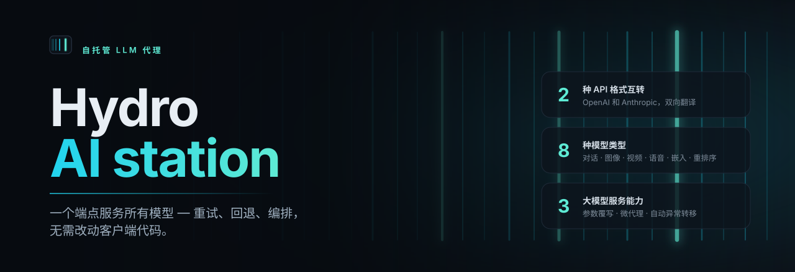
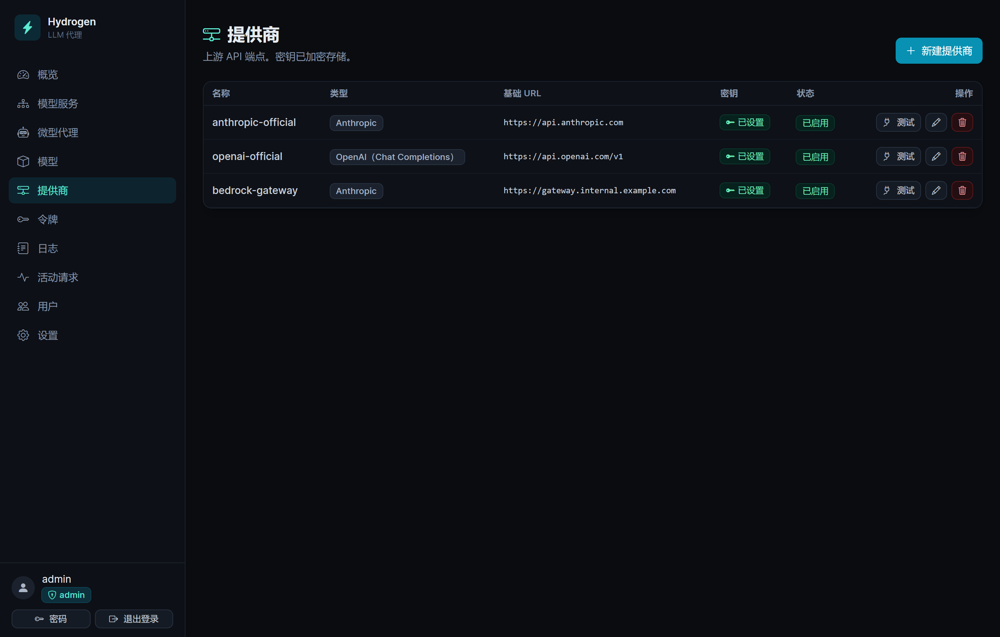
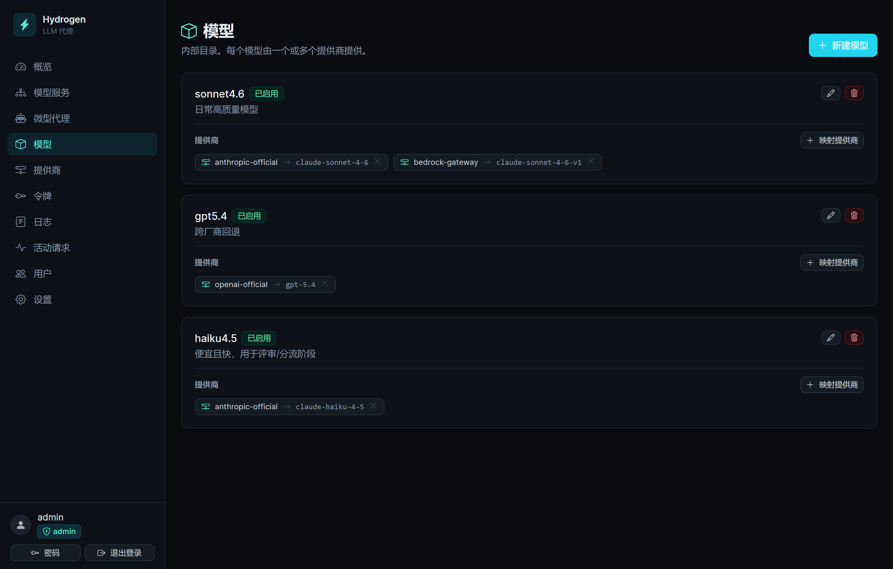
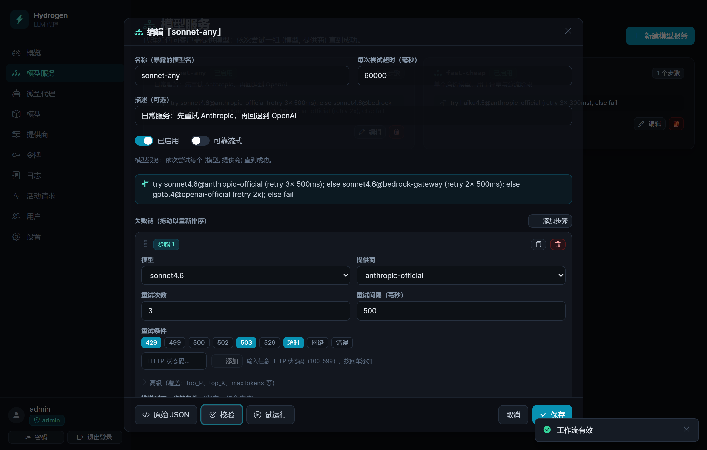
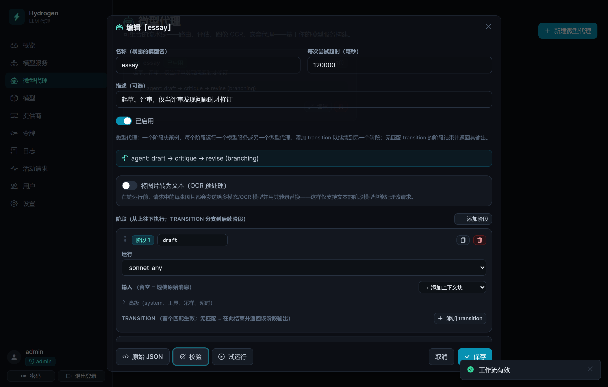

<div align="center">



<p>
  <a href="docs/getting-started.zh.md"><b>快速上手</b></a> ·
  <a href="#部署"><b>部署</b></a> ·
  <a href="#接口"><b>API</b></a> ·
  <a href="#配置"><b>配置</b></a> ·
  <a href="https://github.com/Arrosam/Hydrogen-LLM-proxy/pkgs/container/hydrogen-llm-proxy"><b>Docker 镜像</b></a> ·
  <a href="README.md"><b>English</b></a>
</p>

<p>
  <a href="https://github.com/Arrosam/Hydrogen-LLM-proxy/tags"></a>
  <a href="LICENSE"></a>
  <a href="https://github.com/Arrosam/Hydrogen-LLM-proxy/pkgs/container/hydrogen-llm-proxy"></a>
  <a href="https://github.com/Arrosam/Hydrogen-LLM-proxy/actions/workflows/docker-publish.yml"></a>
  <br>
  
  
  
  <a href="https://github.com/Arrosam/Hydrogen-LLM-proxy/stargazers"></a>
</p>

</div>

---

**Hydrogen** 保管你的大模型供应商 API 密钥，并逐请求决定由哪个供应商的哪个模型来服务。客户端永远不需要
指定真实模型名：它们只需指定一个**模型服务（Model Service）**的名字，Hydrogen 会按该服务定义的有序步骤
（重试 → 供应商回退 → 模型回退）在你自建的目录中执行。它同时支持 **OpenAI** 和 **Anthropic** 两种协议
格式并能双向翻译，所以一个使用 Anthropic 协议的客户端可以被 OpenAI 供应商服务而毫无感知。

一切都在一个容器里运行，内置 SQLite。供应商密钥在存储时加密，客户端密钥只保存哈希值，整个实例——配置、
密钥、用户、日志——可以导出为一个受密码保护的文件。

> **微代理（Micro Agent）** — 一个阶段式流水线（草稿 → 评审 → 修订、路由器、图像 OCR 预处理），
> 客户端调用它就像调用一个普通模型名一样。无需任何客户端适配。
>
> **不止对话** — 模型服务还覆盖图像生成、视频、语音合成、语音识别、向量嵌入和重排序，
> 每一种都享有相同的重试/回退引擎。
>
> **一键部署** — 已上架[雨云应用商店](#1-雨云应用商店一键部署)，
> 或在任何能跑 Docker 的地方拉取预构建镜像。

---

## 工作原理

```
客户端请求  (model = "sonnet-any")   ← 客户端只能看到模型服务
        │
   模型服务 (Model Service)    有序步骤：先试这个，再试那个
        │
   模型 (Model)                你的内部名称，如 "sonnet4.6"
        │
   供应商 (Provider)           Base URL + 加密的 API 密钥
        │
   上游模型 ID                 供应商实际使用的名称，如 "claude-sonnet-4-6"
```

四个概念，各司其职：

| 概念 | 是什么 | 示例 |
|---|---|---|
| **供应商** | 一个上游端点及其 API 密钥 | `openai-official`、`anthropic-official` |
| **模型** | 你为一个模型起的内部名称 | `sonnet4.6` |
| **映射** | 哪个供应商提供这个模型，用什么 ID | `sonnet4.6 → anthropic-official`，上游 ID `claude-sonnet-4-6` |
| **模型服务** | 客户端请求的名称，以及背后的规则 | `sonnet-any` |

模型服务的每个步骤绑定一个明确的**（模型, 供应商）**对，拥有各自的重试次数、重试间隔和触发重试或推进的
故障类别。供应商回退和模型回退都只是"再加一步"而已。如果所有步骤都耗尽了，真实的上游错误会被翻译成客户端
自己的协议格式返回。

| 模型服务 | 行为 |
|---|---|
| `sonnet-any` | 先尝试 `sonnet4.6 @ anthropic`，失败则回退到 `gpt5.4 @ openai` |
| `sonnet-persist` | 尝试 `sonnet4.6 @ anthropic`，重试 5 次，间隔 1 秒 |
| `essay`（微代理） | `draft` → `critique` → `revise`，评审通过时直接返回草稿 |

好处：切换供应商、添加回退、限制思考预算或插入一个完整的代理流水线，全部都是仪表板上的编辑操作。
客户端代码继续请求 `sonnet-any`，完全无感。

---

## 功能概览

- **两种协议格式，双向翻译。** OpenAI Chat Completions、OpenAI Responses 和 Anthropic Messages
  ——流式/非流式、工具调用、图像和思考块都完整保留而非丢弃。
- **八种服务类型。** `chat`、`ocr`、`image`、`video`、`tts`、`stt`、`embedding`、`rerank`
  ——非对话类型使用 OpenAI 风格的直通代理，同样跑你的步骤链。
- **微代理。** 只进不退的阶段流水线，支持条件分支和路由器。每个阶段运行一个已保存的模型服务，
  继承该服务的全部韧性配置。支持嵌套，环路会被拒绝。
- **逐步参数覆写。** Temperature、top-p/top-k、max tokens、停止序列、思考级别、system 覆写，
  以及任意额外 body 参数——都按步骤绑定，不是按客户端。
- **可靠流式。** 缓冲上游流，把中途截断视为可重试错误，重放完整响应——或者返回干净的 502，
  永远不会只给一半。
- **带缓存的图像 OCR。** 视觉预处理阶段将图像转为文本供下游阶段使用；描述按图像哈希缓存，
  在 LRU 字节预算内复用。
- **强大的 API Key 管理。** 将密钥限定到特定服务，设置请求数和 Token 配额，设定过期时间，
  持有者可在公开的**密钥检查**页面查看自己的状态。
- **可观测性。** 每个请求都记录了每次尝试、请求/响应体、延迟和 Token 用量——代理阶段嵌套在客户端请求下
  ——还有实时**活跃请求**面板和仪表板统计。
- **备份与恢复。** 整个实例打包为一个受密码保护的文件，可恢复到任意其他 Hydrogen 实例。
- **两种角色，两种语言。** admin / manager，仪表板支持英文和中文。
- **默认安全。** 供应商密钥用 AES-256-GCM 加密，密码用 argon2id 散列，客户端密钥用 SHA-256，
  供应商 Base URL 有 SSRF 防护，启动时有主密钥哨兵检查。

<table>
  <tr>
    <td width="50%"><br><sub><b>供应商</b> — 类型、Base URL、密钥状态、发现的模型数量</sub></td>
    <td width="50%"><br><sub><b>模型映射</b> — 一个模型映射到多个供应商：回退的原材料</sub></td>
  </tr>
  <tr>
    <td width="50%"><br><sub><b>模型服务编辑器</b> — 故障链、自然语言摘要和试运行</sub></td>
    <td width="50%"><br><sub><b>微代理编辑器</b> — 阶段、条件转移和 OCR 预处理</sub></td>
  </tr>
</table>

---

## 部署

三种方式，按难度排序：

| | 方式 | 适合场景 |
|---|---|---|
| **1** | [雨云应用商店](#1-雨云应用商店一键部署) | 一键部署，无需自己管服务器。托管式，有持久卷和 HTTPS。 |
| **2** | [容器镜像](#2-容器镜像任意-docker-主机) | 任意 VPS 或家用服务器。拉取 `ghcr.io/arrosam/hydrogen-llm-proxy`。 |
| **3** | [源码构建](#3-源码构建) | 本地开发或自定义构建。 |

无论哪种方式，一条规则高于一切：**`/data` 必须持久化。** 它保存着 SQLite 数据库和
`hydrogen-secrets.json`（主密钥），后者用于解密你的供应商 API 密钥。丢失它，Hydrogen 会拒绝启动，
而不是用无法读取的密钥继续运行。

### 1. 雨云应用商店（一键部署）

Hydrogen 已上架雨云云应用商店，无需自行构建。

1. **登录[雨云](https://app.rainyun.com/)。** 还没有账号？通过
   [邀请链接](https://www.rainyun.com/MTA1NzAwNA==_)注册可支持本项目。
2. **打开应用商店** — [app.rainyun.com/apps/rca/store](https://app.rainyun.com/apps/rca/store) —
   搜索 **Hydrogen**，部署到你的项目中。
3. **选择资源配置。** 0.5 核 / 512 MB 足以运行；推荐 1 核 / 1 GB。
4. **保留模板自带的 `/data` 卷**（子路径 `hydrogen/data`）。这是重新部署时不丢失供应商密钥的关键。
5. **环境变量**都是可选的。如需自定义首次登录凭据可设置 `ADMIN_USERNAME` / `ADMIN_PASSWORD`；
   `PROXY_MASTER_KEY` 和 `SESSION_SECRET` **留空**即可，Hydrogen 会自动生成并持久化。
   不要用雨云的随机字符串生成器填充主密钥——生成的不会是有效的 32 字节 base64 密钥，应用会拒绝启动。
6. **打开分配的 URL** 并登录。如果 `ADMIN_PASSWORD` 留空，首次登录凭据为 `admin` / `password`，
   登录后会强制要求设置新密码。

**绑定自定义域名（HTTPS）。** 在已部署的应用中，**服务 → 新增服务 → 类型「HTTPS网站服务」**，
容器端口 `8080`，域名类型选「自定义域名」并填入你的域名。雨云会自动签发和续期 Let's Encrypt 证书。
DNS 端，将 `CNAME` 指向雨云给出的地址——如果该域名在 Cloudflare 上，记录必须保持**仅 DNS（灰色云朵）**：
开启代理会破坏 ACME/SNI 路径，导致证书无法签发。

> **升级。** 雨云应用不支持原地镜像替换：你需要部署更新版本并挂载**相同的**卷子路径（`hydrogen/data`），
> 这样数据库和主密钥会被保留。重新部署后外部端口可能会变——绑定自定义域名可以隔离这种影响。
>
> 要自行发布应用模板（私有 fork、不同镜像源）？具体字段值请参考 **[docs/rainyun.md](docs/rainyun.md)**。

### 2. 容器镜像（任意 Docker 主机）

每次推送到 `main` 分支和每个 `v*` 标签都会构建镜像发布到 GHCR，架构为 `linux/amd64`：

```
ghcr.io/arrosam/hydrogen-llm-proxy:latest     # 随 main 更新——适合试用
ghcr.io/arrosam/hydrogen-llm-proxy:v1.5.2     # 正式环境请锁定版本
```

最快启动方式：

```bash
docker run -d --name hydrogen \
  -p 8080:8080 \
  -v hydrogen-data:/data \
  ghcr.io/arrosam/hydrogen-llm-proxy:v1.5.2
```

然后 `docker logs hydrogen`——初始管理员凭据会打印在一个醒目的横幅中——接着打开
<http://localhost:8080>。

**使用 compose**——这是在正式服务器上推荐的方式。[`deploy/vps/`](deploy/vps) 中有一套现成的配置，
`/data` 用 bind mount 保存在 compose 文件旁边，`tar czf backup.tgz data/` 即可完整备份：

```bash
mkdir -p /srv/hydrogen && cd /srv/hydrogen
curl -O https://raw.githubusercontent.com/Arrosam/Hydrogen-LLM-proxy/main/deploy/vps/docker-compose.yml
curl -O https://raw.githubusercontent.com/Arrosam/Hydrogen-LLM-proxy/main/deploy/vps/Caddyfile
curl -O https://raw.githubusercontent.com/Arrosam/Hydrogen-LLM-proxy/main/deploy/vps/docker-compose.tls.yml
printf 'HYDROGEN_TAG=v1.5.2\n' > .env
docker compose up -d
```

这会在端口 8080 暴露 HTTP，你可以先用 IP 做冒烟测试，再动 DNS。
域名就绪后，叠加 TLS 配置——它会将应用收到 loopback 并在前面放一个带有 Let's Encrypt 自动证书的 Caddy：

```bash
printf 'HYDROGEN_DOMAIN=llm.example.com\nACME_EMAIL=you@example.com\n' >> .env
docker compose -f docker-compose.yml -f docker-compose.tls.yml up -d
```

Caddy 需要端口 **80 和 443** 空闲，且 `A` 记录已指向该机器，**不能**被 Cloudflare 代理。
如果 443 被占用或无法取消 Cloudflare 代理，在别处终止 TLS——Cloudflare Tunnel 指向
`127.0.0.1:8080` 就很好用——并保持 `COOKIE_SECURE=auto` 让会话 cookie 跟随 `X-Forwarded-Proto`。

升级：修改 `HYDROGEN_TAG`，然后 `docker compose pull && docker compose up -d`。
容器自带 `/healthz` 健康检查，`docker ps` 即可确认新版本是否成功启动。

### 3. 源码构建

需要 **Node 20+**（Docker 镜像使用 Node 22 构建）。

```bash
git clone https://github.com/Arrosam/Hydrogen-LLM-proxy.git
cd Hydrogen-LLM-proxy
cp .env.example .env          # 按需设置 ADMIN_USERNAME / ADMIN_PASSWORD
docker compose up -d --build  # 本地构建镜像，数据存入命名卷
```

仓库根目录的 [`docker-compose.yml`](docker-compose.yml) 会从工作树构建而非拉取镜像，改代码时用这个。

不用 Docker 也行——注意 `.env` 文件是 Docker Compose 读取的，裸机运行需要自行导出环境变量：

```bash
npm install
npm run build                 # web → web/dist, server → server/dist/server.cjs
DATA_DIR=./data node server/dist/server.cjs
```

`PROXY_MASTER_KEY` 和 `SESSION_SECRET` 不设就好，Hydrogen 会在首次启动时生成强随机值并保存到
`$DATA_DIR/hydrogen-secrets.json`。如果要自行管理：

```bash
node -e "console.log('PROXY_MASTER_KEY='+require('crypto').randomBytes(32).toString('base64'))"
node -e "console.log('SESSION_SECRET='+require('crypto').randomBytes(48).toString('base64'))"
```

---

## 首次使用

登录后，按以下顺序操作——每步都依赖前一步：

1. **供应商** — Base URL、类型（`OpenAI Chat Completions` / `OpenAI Responses` / `Anthropic`）和
   API 密钥（保存即加密）。先点**测试**：它会列出该供应商自己的模型并记住，
   这样下一步的*上游模型 ID* 就变成了菜单选择而非靠记忆填写。
   任何 OpenAI 兼容的服务都可以用——Ollama、vLLM、OpenRouter、Groq。
2. **模型 + 映射** — 你的内部名称（如 `sonnet4.6`），然后**映射供应商**，将它绑定到一个供应商及其上游 ID。
   将同一个模型映射到多个供应商即可实现回退。
3. **模型服务** — 客户端将使用的名称。构建故障链，点**验证**可阅读自然语言摘要，
   点**试运行**可证明密钥和模型 ID 确实能用。
4. **API 密钥** — 仅管理员可操作。创建后以 `sk-hproxy-…` 形式显示一次，之后只保存哈希。
5. **调用** — 将任何 OpenAI SDK 指向 `http://localhost:8080/v1`，
   Anthropic SDK 指向 `http://localhost:8080`，`model` 设为模型服务名称。

```bash
curl http://localhost:8080/v1/chat/completions \
  -H "Authorization: Bearer sk-hproxy-..." \
  -H "content-type: application/json" \
  -d '{"model":"sonnet-any","messages":[{"role":"user","content":"hello"}]}'

curl http://localhost:8080/v1/messages \
  -H "x-api-key: sk-hproxy-..." \
  -H "anthropic-version: 2023-06-01" \
  -H "content-type: application/json" \
  -d '{"model":"sonnet-any","max_tokens":256,"messages":[{"role":"user","content":"hello"}]}'
```

完整教程（含一个草稿 → 评审 → 修订微代理的完整示例）参见
**[docs/getting-started.zh.md](docs/getting-started.zh.md)**（[English](docs/getting-started.md)）。

---

## 接口

**面向客户端。** 使用 `Authorization: Bearer …` 或 `x-api-key: …` 认证；`model` 始终为模型服务名称。

| 方法 | 路径 | 类别 | 说明 |
|---|---|---|---|
| POST | `/v1/chat/completions` | chat | OpenAI Chat Completions，流式 + 非流式 |
| POST | `/v1/responses` | chat | OpenAI Responses API |
| POST | `/v1/messages` | chat | Anthropic Messages |
| GET | `/v1/models` | — | 列出你的模型服务（发送 `anthropic-version` 头则返回 Anthropic 格式） |
| POST | `/v1/embeddings` | embedding | OpenAI 兼容供应商 |
| POST | `/v1/rerank` | rerank | |
| POST | `/v1/images/generations` | image | |
| POST | `/v1/videos` | video | 返回带路由后缀的任务 ID |
| GET | `/v1/videos/:id` · `/v1/videos/:id/content` | video | 轮询和下载，无状态路由 |
| POST | `/v1/audio/speech` | tts | 二进制音频流直通 |
| POST | `/v1/audio/transcriptions` | stt | multipart，`model` 字段被改写后转发 |

因为 `/v1/models` 返回的是模型服务，任何有模型选择器的工具都会显示你的服务名
——这正是设计意图：`sonnet-any` *就是*模型，对客户端而言。

**管理端。** `POST /admin/api/login` 后使用 session cookie 访问 `/admin/api/*`
（供应商、模型、映射、服务、密钥、用户、日志、统计、设置、备份）。与仪表板 SPA 一同提供。
**公开接口：** `GET /healthz` 和 `/check` 密钥状态页。

---

## 配置

所有变量都是可选的，默认值即容器出厂设置。

| 变量 | 默认值 | 用途 |
|---|---|---|
| `PORT` | `8080` | 仪表板**和** API 共用一个端口 |
| `DATA_DIR` | `/data` | SQLite + `hydrogen-secrets.json`。**必须持久化** |
| `PROXY_MASTER_KEY` | *自动生成* | 32 字节 base64。加密供应商密钥（AES-256-GCM） |
| `SESSION_SECRET` | *自动生成* | 签名仪表板会话 cookie |
| `ADMIN_USERNAME` / `ADMIN_PASSWORD` | `admin` / *（空）* | 首个管理员。密码为空 ⇒ 首次登录 `admin`/`password`，强制修改 |
| `SESSION_TTL` | `12h` | 仪表板会话有效期 |
| `COOKIE_SECURE` | `auto` | `auto` 根据 `X-Forwarded-Proto` 判断；`false` 用于纯 HTTP；`true` 强制 |
| `LOG_PAYLOAD_MAX_CHARS` | `2000000` | 每条日志记录的请求/响应体上限。`0` = 不限（数据库无限增长） |
| `ALLOW_PRIVATE_UPSTREAMS` | `false` | 允许供应商 Base URL 指向回环/内网地址（如本地 Ollama）。链路本地元数据地址始终被拒绝 |
| `SIMULATED_STREAMING_TOKEN_RATE` | `2000` | 缓冲流的重放速率（tokens/秒） |
| `IMAGE_CACHE_MAX_BYTES` | `67108864` | OCR 图像描述的 LRU 缓存预算。`0` 禁用 |
| `STREAM_COMMIT_GRACE_MS` | `2500` | 流式响应静默多久后提交并开始发送保活 ping |
| `STREAM_PING_INTERVAL_MS` | `10000` | 提交后的保活间隔 |
| `NODE_ENV` | `production` | `development` 开启详细日志 |

日志保留策略、OCR 缓存预算、内网上游白名单和仪表板语言也可在运行时从**设置**中修改，
运行时的值会覆盖这些启动时的默认值。

带注释的完整版见 [`.env.example`](.env.example)。

---

## 角色

- **admin** — 全部权限，包括签发 API 密钥、管理用户和访问**设置**。
- **manager** — 除签发 API 密钥和设置以外的全部权限，且不能创建或修改 admin 账户（防止权限提升）。

---

## 备份与恢复

**设置 → 备份与恢复**（仅 admin）将整个实例——供应商、模型、映射、服务、代理、API 密钥、用户、设置，
以及可选的请求日志和图像缓存——导出为一个 JSON 文件，可恢复到任意其他 Hydrogen 实例。
客户端 API 密钥和仪表板密码会继续可用，因为它们的哈希值随文件一起迁移。

供应商 API 密钥需要特殊处理，因为它们用 `PROXY_MASTER_KEY` 加密，而主密钥存在于
`hydrogen-secrets.json` 中而非数据库内。直接复制密文会产生一个只能在原机器上恢复的备份。因此导出时会先
解密密钥，再用你**选择的密码**重新封装（scrypt + AES-256-GCM）；恢复时用该密码解密，
再用*目标*实例的主密钥重新加密。这也使得该文件成为跨实例迁移的工具：从一个实例导出，在另一个上恢复。

两点须知：

- **密码不可找回。** 它从不发送到服务器或存储在服务器上。
- **恢复会替换一切**，在一个事务中——要么完全成功，要么不做任何改动（密码错误或文件损坏会在数据被触碰前被
  拒绝）。恢复后你会被登出，因为你认证所用的账户本身也被替换了。

该文件在没有密码的情况下不包含任何可用的密钥，但它确实包含你的完整配置和请求历史，请妥善保管。

---

## 安全说明

- **供应商 API 密钥**使用 AES-256-GCM 加密（密钥为 `PROXY_MASTER_KEY`），从不以明文离开服务器。
  首次启动时写入一个哨兵值；以不同的主密钥启动，Hydrogen 会**拒绝启动**而不是产生不可预测的行为。
- **客户端 API 密钥**创建时显示一次，只存储 SHA-256 哈希加前缀。
- **密码**使用 argon2id。会话 cookie 带签名、httpOnly、`SameSite=Lax`，在 HTTPS 下标记 `Secure`
  ——请在 TLS 之后提供仪表板。
- **供应商 Base URL** 经过 SSRF 防护检查；私有和回环地址默认拒绝（除非你主动开启），
  链路本地元数据地址始终拒绝。
- **轮换主密钥**目前未自动化。要么重新开始（清空 `/data`），要么在更换密钥后重新输入每个供应商的 API 密钥。

---

## 开发

```bash
npm install
npm run dev            # server (tsx watch) + web (vite)，同时运行
npm run test           # 服务端单元测试：翻译、步骤引擎、流式
npm run typecheck
npm run db:generate    # schema 变更后重新生成 SQL 迁移
```

Vite 开发服务器会将 `/admin/api`、`/v1` 和 `/healthz` 代理到运行中的后端服务
（默认 `http://127.0.0.1:8080`，可用 `HYDROGEN_API` 覆盖）。
`node preview-server.cjs` 提供生产构建的单进程一次性预览（仅限开发密钥）。

```
server/   Fastify + Drizzle (SQLite)
  src/core/format/      OpenAI ⇄ canonical IR ⇄ Anthropic 翻译（含 SSE）
  src/core/proxy/       请求编排
  src/execution/        步骤引擎、微代理运行时、验证器、OCR 缓存
  src/catalog/          模型、供应商、映射解析
  src/transport/        代理、媒体和管理路由
  src/security/         主密钥、供应商密钥加密、密码、Token
  src/observability/    请求日志、活跃请求、用量计量、脱敏
  src/backup/           受密码保护的导出与恢复
web/      React + Vite + Tailwind 仪表板（Bootstrap Icons），英文 + 中文
```

---

## 路线图

- **虚拟供应商** — 一种新的步骤类型，将多次调用的流水线（worker → evaluator → loop-until-done）
  封装在一个模型服务端点背后，复用微代理已有的翻译和韧性层。

## 许可证

[MIT](LICENSE)
