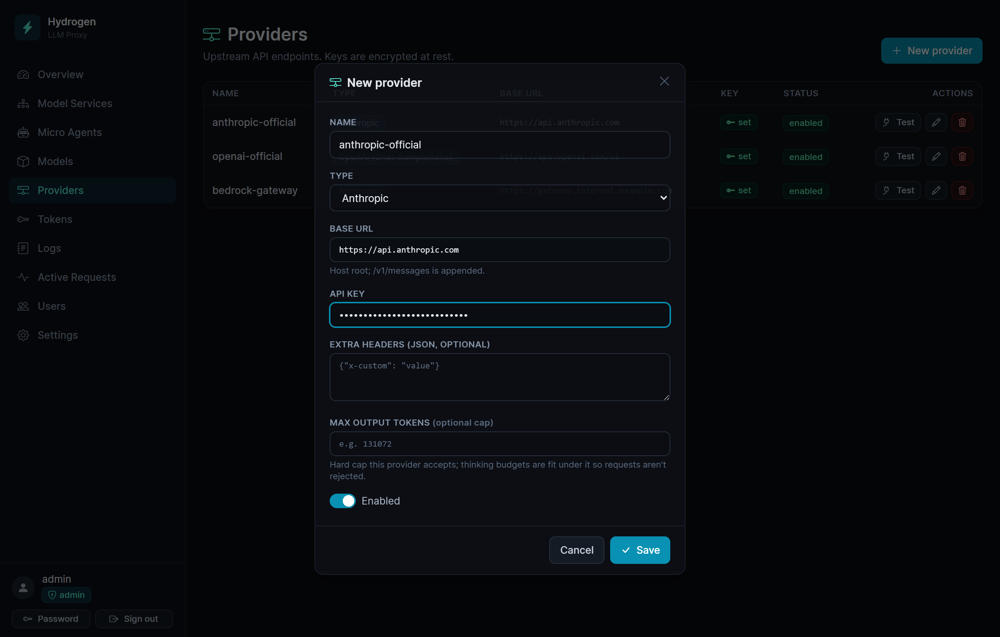
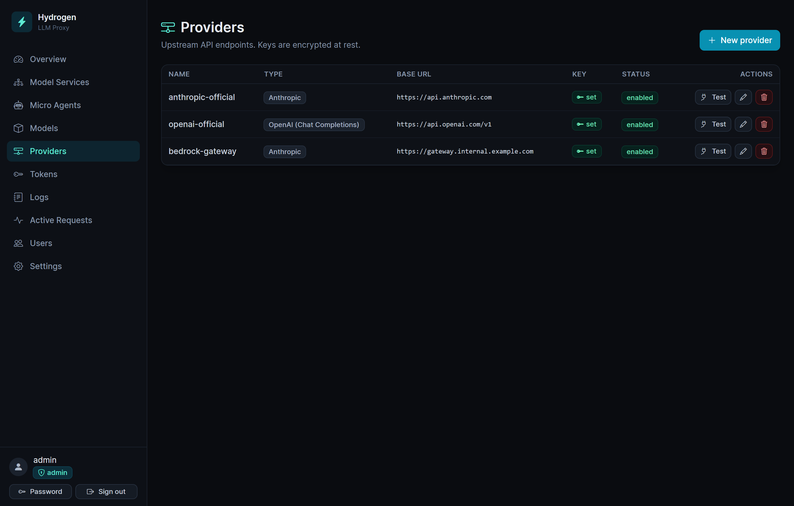
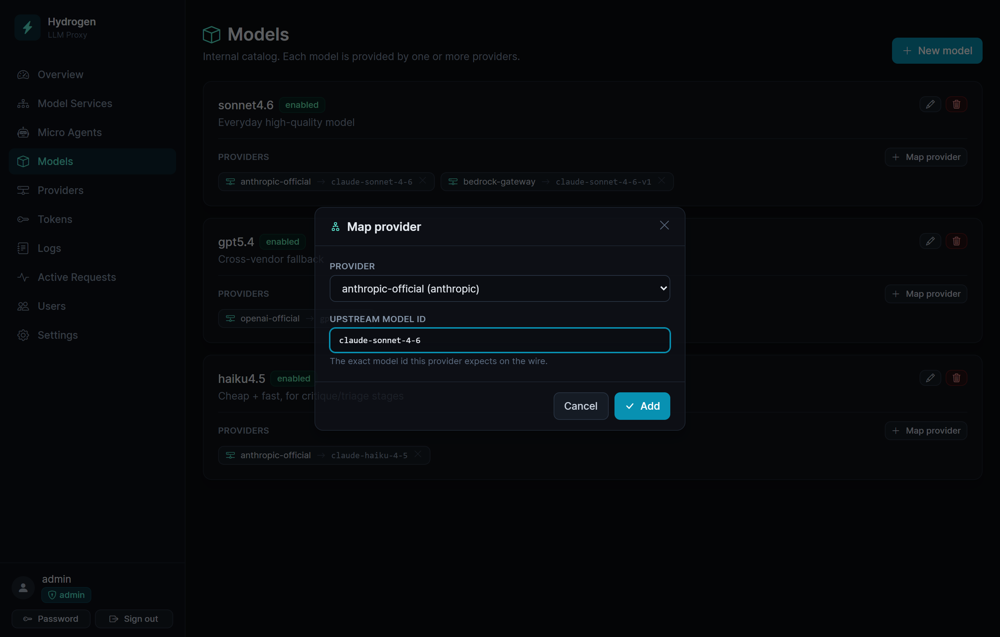
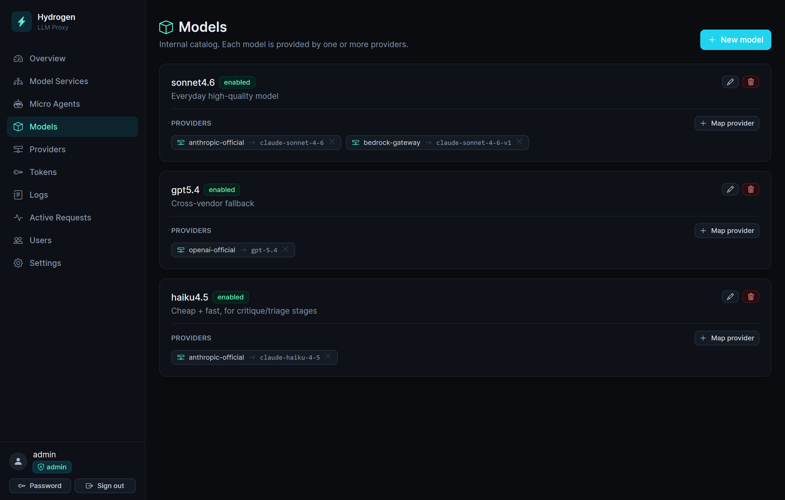
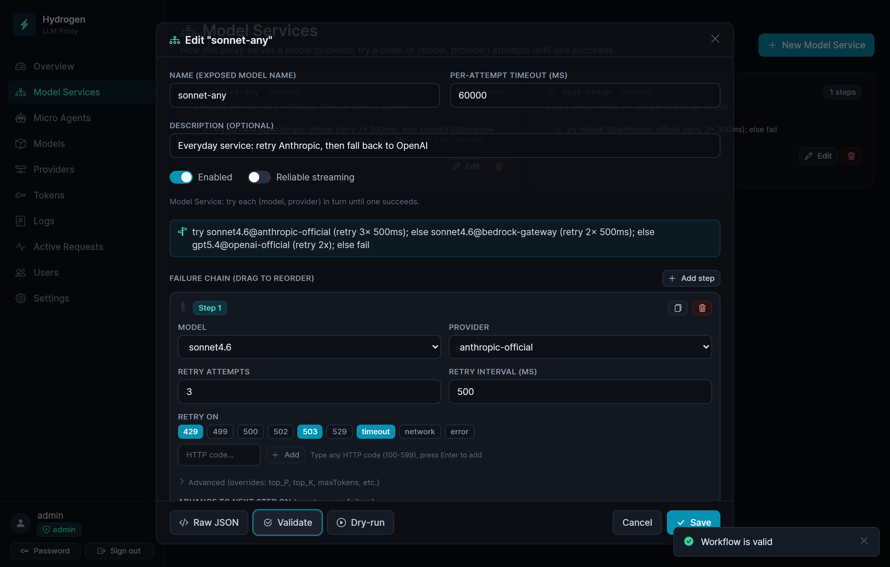
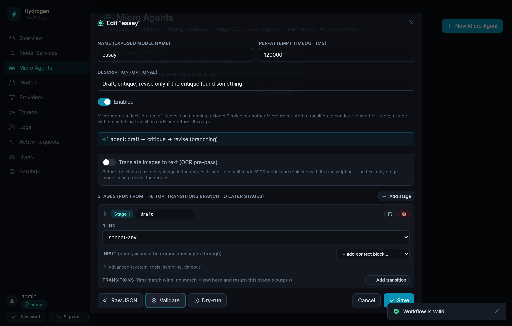
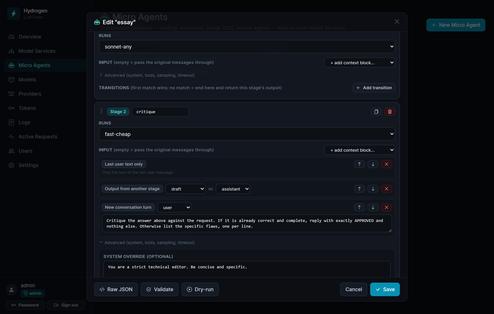
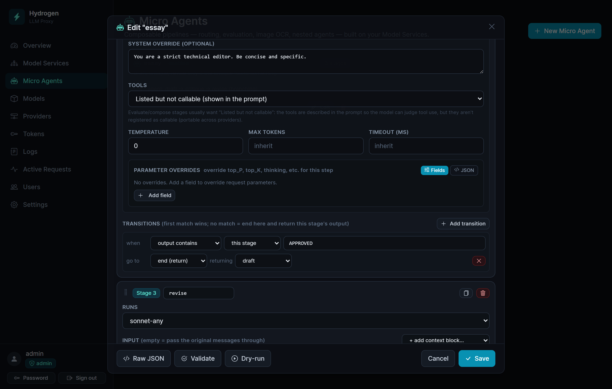

# Getting started with Hydrogen

This guide takes you from a freshly started Hydrogen to a working API call, then shows how to
build a **Micro Agent** — a multi-stage pipeline that clients call as if it were a single model.

If you just want the shortest path: **Provider → Model → Model Service → Token → call it.** That
order is not a suggestion; each step depends on the one before it.

> 中文版：[getting-started.zh.md](getting-started.zh.md)

---

## The mental model

Clients never name a real model. They set `model` to the name of a **Model Service**, and Hydrogen
decides what that means:

```
Client request (model = "sonnet-any")
        │
   Model Service        ordered steps: try this, else that
        │
   Model                your internal name, e.g. "sonnet4.6"
        │
   Provider             base URL + encrypted API key
        │
   Upstream model id    what the provider actually calls it, e.g. "claude-sonnet-4-6"
```

Four concepts, each doing one job:

| Concept | What it is | Example |
|---|---|---|
| **Provider** | An upstream endpoint and its API key. | `openai-official`, `anthropic-official` |
| **Model** | Your internal name for a model. | `sonnet4.6` |
| **Mapping** | Which provider serves a model, and under what id. | `sonnet4.6 → anthropic-official` as `claude-sonnet-4-6` |
| **Model Service** | The name clients request, and the retry/fallback rules behind it. | `sonnet-any` |

The payoff is that swapping providers, adding a fallback, or changing a model is a dashboard edit.
Client code keeps asking for `sonnet-any` and never notices.

---

## Before you start

You need a running Hydrogen and an admin login. If you haven't got that yet, see **Quick start** in
the [README](../README.md). Open the dashboard (`http://localhost:8080` by default) and sign in.

The left sidebar is the map of everything below: **Model Services**, **Micro Agents**, **Models**,
**Providers**, **Tokens**, **Logs**, **Active Requests**.

---

## Step 1 — Add a provider

**Providers → New provider.**



| Field | What to put in it |
|---|---|
| **Name** | Your label for this upstream, e.g. `openai-official`. Model Services refer to it by this name. |
| **Type** | `OpenAI (Chat Completions)`, `OpenAI (Responses API)`, or `Anthropic`. This is the wire format Hydrogen speaks *to this provider* — it has nothing to do with what your clients speak. |
| **Base URL** | See below. |
| **API key** | Encrypted with AES-256-GCM the moment you save. It is never shown again. |
| **Extra headers (JSON, optional)** | For upstreams that need something extra, e.g. `{"x-org": "team-a"}`. |
| **Max output tokens (optional cap)** | A hard ceiling this provider accepts. Thinking budgets get fitted under it, so requests aren't rejected for asking too much. |
| **Enabled** | On. |

**Base URL** depends on the Type, and the dialog tells you which suffix gets appended:

- Anthropic → `https://api.anthropic.com` (host root; `/v1/messages` is appended)
- OpenAI Chat Completions → `https://api.openai.com/v1` (`/chat/completions` is appended)
- OpenAI Responses API → `https://api.openai.com/v1` (`/responses` is appended)

Anything OpenAI-compatible works here — a local Ollama, vLLM, OpenRouter, Groq — pick
`OpenAI (Chat Completions)` and point the Base URL at its `/v1`.

Save, and the provider joins the list. **Test** it right away — it calls the provider's models
endpoint and reports `Connection OK`, which proves the base URL and the key work before you build
anything on top of them. The **Key** column shows `set`, never the key itself.



> **Editing later:** the API key field always opens blank. Leave it blank to keep the existing key;
> type a new one only to replace it.

---

## Step 2 — Add a model, then map it

A model is just a name in your catalog. Mapping is what connects it to a provider.

**Models → New model.** Name it something short and stable — `sonnet4.6`, `gpt5.4`, `fast-local`.
This is *your* name; upstream ids come later, in the mapping. Description is optional.

Now, on that model's card, click **Map provider**:



- **Provider** — the one you made in step 1.
- **Upstream model id** — the exact string that provider expects on the wire, e.g.
  `claude-sonnet-4-6` or `gpt-4o`. Typos here surface as upstream 404s at call time, not now.

Map the same model to **several providers** when more than one can serve it (say, Anthropic direct
and a Bedrock-style gateway). That's what makes provider-fallback possible in the next step. Each
mapping shows as a `provider → upstream-id` chip:



Note `sonnet4.6` above carries two mappings. One model, two ways to serve it — that is the raw
material for a fallback chain.

> Clicking **Map provider** with no providers gives you *"Create a provider first"*. The order
> matters.

---

## Step 3 — Build a Model Service

This is the name your clients will actually use.

**Model Services → New Model Service.**

| Field | Notes |
|---|---|
| **Name (exposed model name)** | What clients send as `model`. e.g. `sonnet-any`. |
| **Per-attempt timeout (ms)** | Applies to *each* attempt, not the whole service. Default 60000. |
| **Description (optional)** | For your future self. |
| **Enabled** | On. |
| **Reliable streaming** | See below. Leave off for now. |

Then build the **Failure chain**. Each step pins one explicit **(Model, Provider)** pair:

- **Model** / **Provider** — the provider dropdown only offers providers you actually mapped that
  model to. `(no providers mapped)` means go back to step 2.
- **Retry attempts** and **Retry interval (ms)** — retries *within* this step, same model, same
  provider.
- **Retry on** — which failures retry. Click the chips (`429`, `499`, `500`, `502`, `503`, `529`,
  `timeout`, `network`, `error`), or type any HTTP code and press Enter.
- **Advance to next step on** — which failures give up on this step and move to the next one.
  Empty means *any* failure. `exhausted` means "only after this step's retries are used up" — that
  combination (retry a few times, then fall back) is usually what you want.

A single step with no retries is a perfectly good Model Service. Start there.

**Adding resilience is just adding steps.** The chain runs top to bottom, and if the last step still
fails, the real upstream error goes back to the client:

- **Provider fallback** — same model, different provider. The **duplicate** button (⧉) on a step
  copies it and switches to another mapped provider, which is exactly this.
- **Model fallback** — different model entirely. Add a step, pick another model.

So `sonnet-any` below does both, in three steps: try `sonnet4.6 @ anthropic-official` (retrying
`429`/`503`/`timeout`, advancing once `exhausted`), fall back to the *same model* on
`bedrock-gateway`, and only then give up on Sonnet entirely and cross vendors to
`gpt5.4 @ openai-official`.



Before saving, use the footer buttons:

- **Validate** — checks the shape and that every (model, provider) pair is really mapped. It prints
  the plain-English summary you can see in the banner above:
  `try sonnet4.6@anthropic-official (retry 3× 500ms); else sonnet4.6@bedrock-gateway (retry 2× 500ms); else gpt5.4@openai-official (retry 2x); else fail`.
  Read that line back — it is the fastest way to catch a chain that doesn't do what you meant.
- **Dry-run** — actually sends `ping` upstream and tells you which step served it. This is the step
  that catches a wrong API key or a bad upstream model id.
- **Raw JSON** — the same definition as text. Useful for copy-paste and for anything the visual
  editor doesn't expose.

> **Retry defaults differ between the two editors.** A new step in the visual editor starts at
> **1 attempt with no triggers** — no retries. If you write Raw JSON and *omit* the `retry` block
> entirely, the server's defaults apply instead: **3 attempts** on
> `429`, `499`, `502`, `503`, `timeout`, `network`. Omitting is not the same as leaving it blank.

### Reliable streaming

Off (default), a streaming request relays token by token — real-time, but once the headers are sent
a mid-stream truncation can't be retried.

On, Hydrogen streams from the upstream, buffers the whole thing (a truncated stream counts as a
retryable failure under your rules), then replays the complete result. The client gets a whole
response or a clean 502 — never a half one. It costs first-token latency. Worth it for unattended
jobs; usually not for a chat UI.

---

## Step 4 — Issue a token

**Tokens → Issue token.** Admin-only; managers can't issue tokens.

- **Name** — e.g. `my-laptop`. Required.
- **Scope** — **Allow all Model Services** is checked by default. Uncheck it to tick specific
  services, which is how you hand someone a key that can only reach the cheap one.
- **Max requests / Max tokens (optional)** — quotas for this token.
- **Expires at (optional)**.

The token appears **once**, as `sk-hproxy-...`. Copy it now — only a hash is stored, so nobody,
including you, can recover it later. Lost token, new token.

---

## Step 5 — Call it

Point any OpenAI SDK at `http://localhost:8080/v1`, or any Anthropic SDK at `http://localhost:8080`.
Set `model` to your **Model Service name**.

```bash
# OpenAI wire format
curl http://localhost:8080/v1/chat/completions \
  -H "Authorization: Bearer sk-hproxy-..." \
  -H "content-type: application/json" \
  -d '{"model":"sonnet-any","messages":[{"role":"user","content":"hello"}]}'

# Anthropic wire format — same service, same upstreams
curl http://localhost:8080/v1/messages \
  -H "x-api-key: sk-hproxy-..." \
  -H "anthropic-version: 2023-06-01" \
  -H "content-type: application/json" \
  -d '{"model":"sonnet-any","max_tokens":256,"messages":[{"role":"user","content":"hello"}]}'
```

The client's format and the provider's format are independent. An Anthropic-speaking client can be
served by an OpenAI provider, and vice versa — Hydrogen translates both ways.

| Method | Path |
|---|---|
| POST | `/v1/chat/completions` |
| POST | `/v1/responses` |
| POST | `/v1/messages` |
| POST | `/v1/embeddings` |
| GET | `/v1/models` — lists your Model Services (Anthropic shape if you send `anthropic-version`) |

Since `/v1/models` returns Model Services, tools that populate a model picker will show your service
names. That's the intent: `sonnet-any` *is* the model, as far as any client is concerned.

## Step 6 — Watch it

**Logs** shows every request: which service, which steps were attempted, status, latency, tokens,
and the request/response payloads. When a fallback fires, this is where you see it happen.
**Active Requests** shows what's in flight right now.

---

# Advanced — building a Micro Agent

Everything above routes **one** request to **one** upstream call. A **Micro Agent** runs *several*
model calls — stages — and still presents itself to clients as one model name.

Because a Micro Agent *is* a Model Service as far as the outside world is concerned, it needs no
client support at all. You point an existing app at `essay` instead of `sonnet-any`, and it
transparently gets a draft-critique-revise loop. Agents can also be stages inside other agents.

**Micro Agents → New Micro Agent.**



Same shell as a Model Service — name, timeout, Validate, Dry-run, Raw JSON — but the body is a list
of **stages** instead of a failure chain, and the summary reads
`agent: draft → critique → revise (branching)`.

## How a Micro Agent runs

Stages run **top to bottom**. After each one, its **transitions** are checked in order and the first
match wins. No match means fall through to the next stage; running off the end finishes the agent.
By default the agent returns the output of the stage where it stopped.

Two rules that shape every design:

- **Transitions are forward-only.** You can skip ahead, never back. There are no loops — a
  fixed-length pipeline always terminates. Validation rejects a backwards `goto`.
- **Each stage runs a saved Model Service** (or another Micro Agent), so every stage inherits that
  service's retry and fallback rules for free. Build the resilience once, reuse it in every stage.

## A worked example: draft → critique → revise

The classic quality pipeline. Write an answer, have a cheap model criticize it, and revise only if
the critique found something. Assume you already have two Model Services: `sonnet-any` (good) and
`fast-cheap` (fast).

**Stage 1 — `draft`**
- **Runs:** `sonnet-any`
- **Input:** *empty* — the original messages pass straight through, exactly as the client sent them.

**Stage 2 — `critique`**
- **Runs:** `fast-cheap`
- **Input:** three context blocks, in order — this is where you compose what the model sees:
  1. `Last user text only` — what was originally asked
  2. `Output from another stage` → `draft`, as **assistant**
  3. `New conversation turn` (user): *"Critique the answer above against the request. If it is
     already correct and complete, reply with exactly APPROVED and nothing else. Otherwise list the
     specific flaws, one per line."*
- **Advanced → System override:** *"You are a strict technical editor. Be concise and specific."*
- **Advanced → Tools:** `Listed but not callable` — see the note below.
- **Advanced → Temperature:** `0`
- **Transition:** when **output contains** `APPROVED` → go to **end (return)**, returning **`draft`**.

The three context blocks stack up in order — this is the whole prompt, assembled by hand:



And the branch itself, reading almost like a sentence — *when output contains `APPROVED`, go to end,
returning `draft`*:



**Stage 3 — `revise`**
- **Runs:** `sonnet-any`
- **Input:**
  1. `Last user text only`
  2. `Output from another stage` → `draft`, as **assistant**
  3. `New conversation turn` (user): *"A reviewer raised these points:"*
  4. `Output from another stage` → `critique`, as **user**
  5. `New conversation turn` (user): *"Rewrite your answer to address every point. Reply with the
     rewritten answer only."*

If the critique says `APPROVED`, the agent stops at stage 2 and returns the **draft** — note it
returns stage 1's text, not the word "APPROVED". Otherwise it falls through to `revise`, which is
the last stage, so its output is what the client gets. The client sees one ordinary response either
way.

Here is the same agent as **Raw JSON** — paste it into the editor's Raw JSON tab to skip the
clicking:

```json
{
  "kind": "micro_agent",
  "timeoutMs": 120000,
  "stages": [
    {
      "name": "draft",
      "service": "sonnet-any",
      "input": []
    },
    {
      "name": "critique",
      "service": "fast-cheap",
      "input": [
        { "kind": "last_user_text" },
        { "kind": "stage_output", "stage": "draft", "role": "assistant" },
        {
          "kind": "message",
          "role": "user",
          "text": "Critique the answer above against the request. If it is already correct and complete, reply with exactly APPROVED and nothing else. Otherwise list the specific flaws, one per line."
        }
      ],
      "tools": "none",
      "system": "You are a strict technical editor. Be concise and specific.",
      "temperature": 0,
      "transitions": [
        { "when": { "type": "output_contains", "value": "APPROVED" }, "goto": "end", "output": "draft" }
      ]
    },
    {
      "name": "revise",
      "service": "sonnet-any",
      "input": [
        { "kind": "last_user_text" },
        { "kind": "stage_output", "stage": "draft", "role": "assistant" },
        { "kind": "message", "role": "user", "text": "A reviewer raised these points:" },
        { "kind": "stage_output", "stage": "critique", "role": "user" },
        { "kind": "message", "role": "user", "text": "Rewrite your answer to address every point. Reply with the rewritten answer only." }
      ]
    }
  ]
}
```

Hit **Validate**, then **Save**. Scope a token to it (or use an all-services token) and call it by
name:

```bash
curl http://localhost:8080/v1/chat/completions \
  -H "Authorization: Bearer sk-hproxy-..." \
  -H "content-type: application/json" \
  -d '{"model":"essay","messages":[{"role":"user","content":"Explain B-trees to a new grad."}]}'
```

Then open **Logs** and expand the entry. Every stage is listed as its own call, with its own
attempts, payloads and token usage, nested under the one client request. That is the tool for
understanding why an agent did what it did.

## Composing a stage's input

The **Input** list *is* the prompt engineering. Leave it empty and the stage receives the original
conversation untouched. Add blocks and you build the messages yourself, in order:

| Block | What it contributes |
|---|---|
| `Original full conversation` | Every message the client sent, verbatim. |
| `Text-only conversation` | The same, minus images. |
| `Last user request` | Only the most recent user turn (text + images). |
| `Last user text only` / `Last user images only` | Just one half of it. |
| `Output from another stage` | An earlier stage's output, injected as **assistant** or **user**. |
| `New conversation turn` | A fixed instruction you write, as user or assistant. |
| `Tool use turn` | A synthetic tool call + result pair, for priming tool-shaped context. |

Only **earlier** stages can be referenced — validation enforces it. Consecutive blocks with the same
role merge into one message, so a run of user blocks becomes a single user turn.

**About the Tools setting:** `Inherit` keeps the client's tools callable. `Listed but not callable`
renders the tool definitions into the system prompt as reference and doesn't register them — which
is what evaluate/compose stages usually want. A critic should be able to *judge* a tool call, not
make one, and this is also the portable choice, since `tool_choice: "none"` is widely rejected.

## Routers: branch without spending a call

A stage whose **Runs** is set to `router (no model call — route by input only)` makes no model call
at all. It just evaluates its transitions against the original input and jumps. Put one first to
send trivial requests down a cheap path:

```
stage 1  triage (router)   when input matches ^\s*(hi|hello|thanks)\b   → go to  quick
                           (no match → falls through to draft)
stage 2  quick             always → end
stage 3  draft   …
```

`quick` needs that `always → end` transition. Without it, it would fall through into `draft` and
you'd pay for the expensive path anyway.

Conditions available: `always`, `input has image`, `input contains`, `input matches` (regex),
`output contains`, `output matches` (regex).

> **Regex gotcha:** patterns compile as plain JavaScript `RegExp` with no flags. Inline flags like
> `(?i)` are a syntax error, and an invalid pattern silently never matches — so a `(?i)hello`
> condition just never fires. Use `[Hh]ello` instead. **Validate** rejects invalid regexes at save
> time, which is the moment to catch it.

## Image translation (OCR)

Toggle **Image translation (OCR)** to run a vision Model Service *before* stage 1. Every image in
the request is transcribed to text and replaced inline, so downstream stages — and text-only models
— receive a fully textual conversation. The default prompt handles multiple images and returns
structured results; the advanced panel lets you replace it. The OCR stage must be a plain Model
Service, not another Micro Agent.

## Things to know before you rely on it

- **Streaming is buffered.** Routing needs each stage's complete output, so an agent always runs
  fully, then replays the result as a paced stream. Clients still get a normal SSE stream; they just
  wait longer for the first token.
- **Cost multiplies.** Three stages means three billed calls. The reported usage on the response is
  the **sum across all stages**, so your numbers stay honest.
- **Timeouts are per-attempt, not per-agent.** The agent's own `timeoutMs` is a default that stages
  inherit; a stage can override it. A five-stage agent can legitimately run for minutes — size the
  client's timeout accordingly.
- **Nesting is allowed** up to 8 deep, and cycles are detected and rejected at runtime rather than
  looping forever.
- **A stage failure fails the whole agent.** There is no "continue on error" — put the resilience in
  the Model Service each stage runs, which is exactly what Model Services are for.

---

## Troubleshooting

| What you see | What it means |
|---|---|
| `(no providers mapped)` in a step's provider dropdown | That model has no mapping yet. Models → **Map provider**. |
| Validate: *"These (model, provider) pairs are not mapped in the catalog"* | The step points at a pair that doesn't exist. Fix the mapping or the step. |
| Dry-run fails with a 401/403 | Wrong API key on the provider. Re-enter it (blank = keep current, so you must type the new one). |
| Dry-run fails with a 404 | The **Upstream model id** in the mapping isn't what that provider calls it. |
| Client gets 401 from Hydrogen | Bad or revoked token, or the token isn't scoped to that service. |
| Client gets 404 for the model | The `model` you sent isn't a Model Service name, or the service is disabled. |
| *"Create a provider first"* | Provider → Model → Mapping. In that order. |
| Agent: *"references unknown Model Service or Micro Agent"* | A stage names a service that doesn't exist. Save the Model Service first. |
| Agent: *"transition goto ... must be a later stage"* | Transitions are forward-only. Reorder the stages instead. |
| Hydrogen refuses to boot | `PROXY_MASTER_KEY` changed and no longer matches the encrypted keys. See **Security notes** in the [README](../README.md). |
