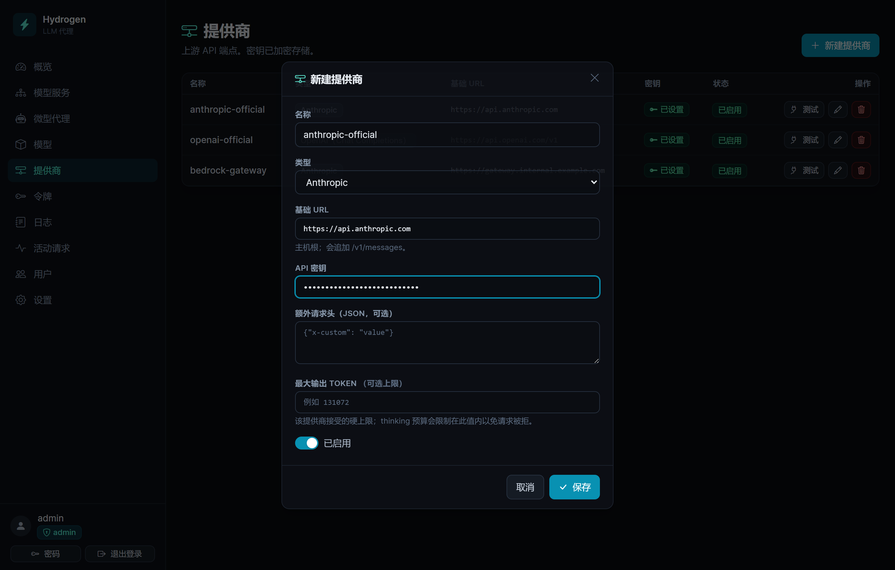
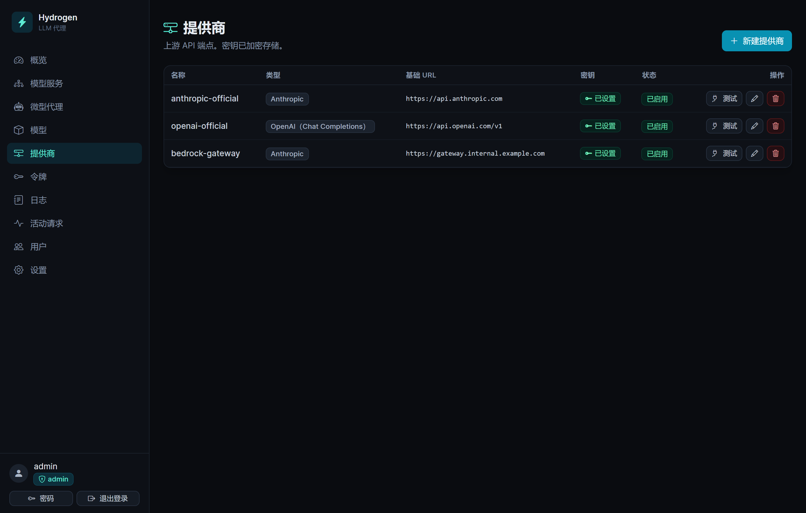
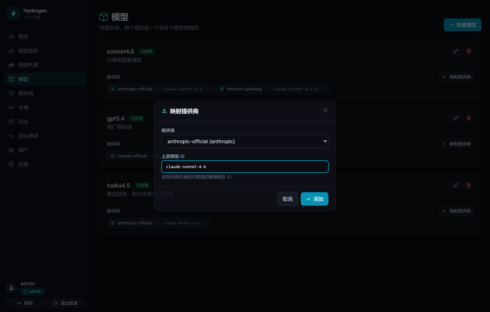
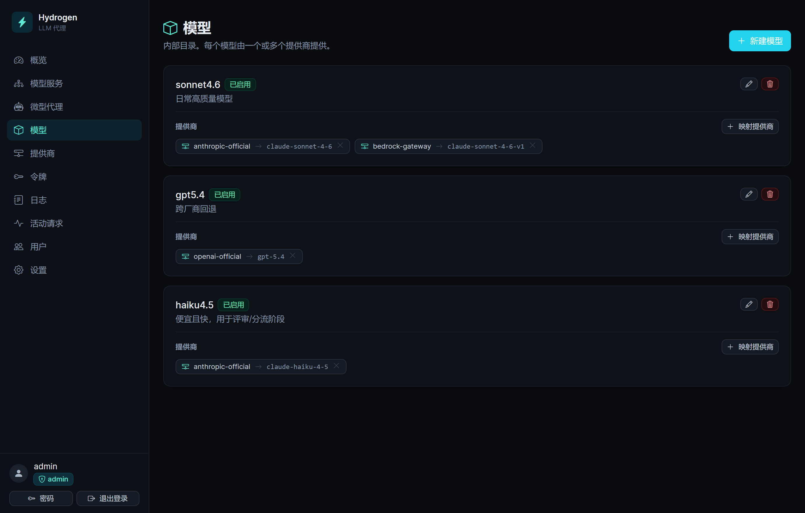
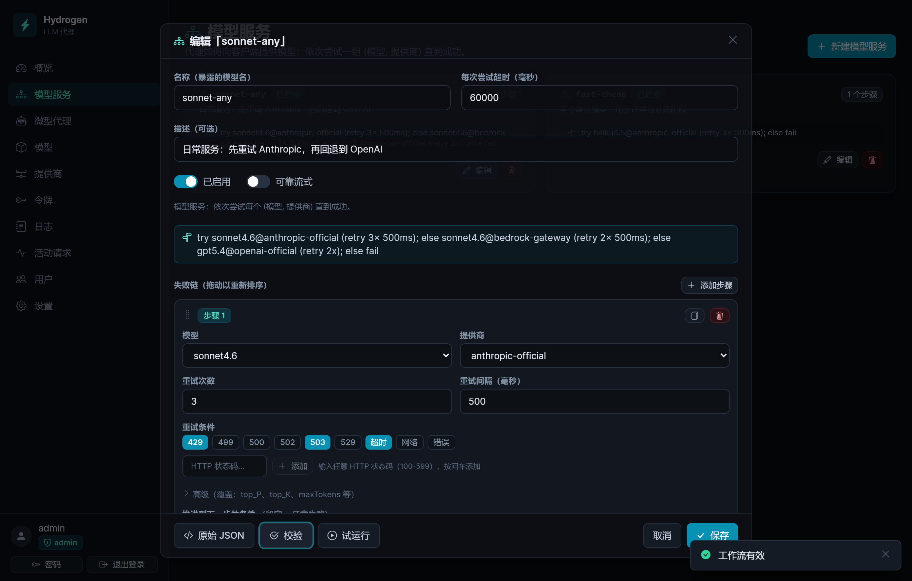
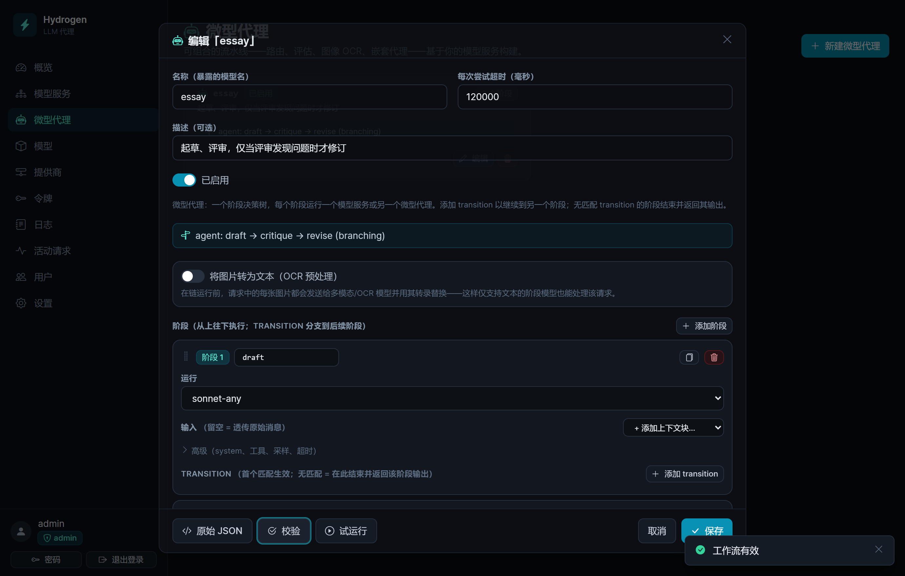
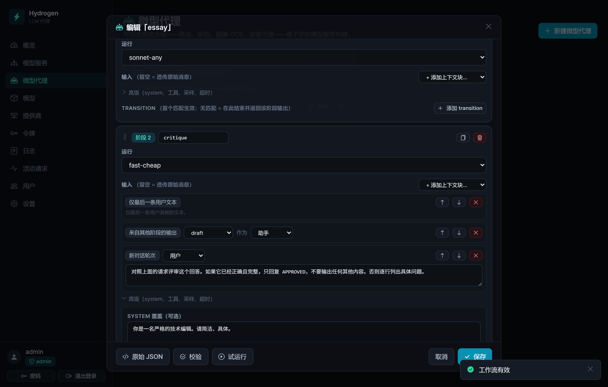
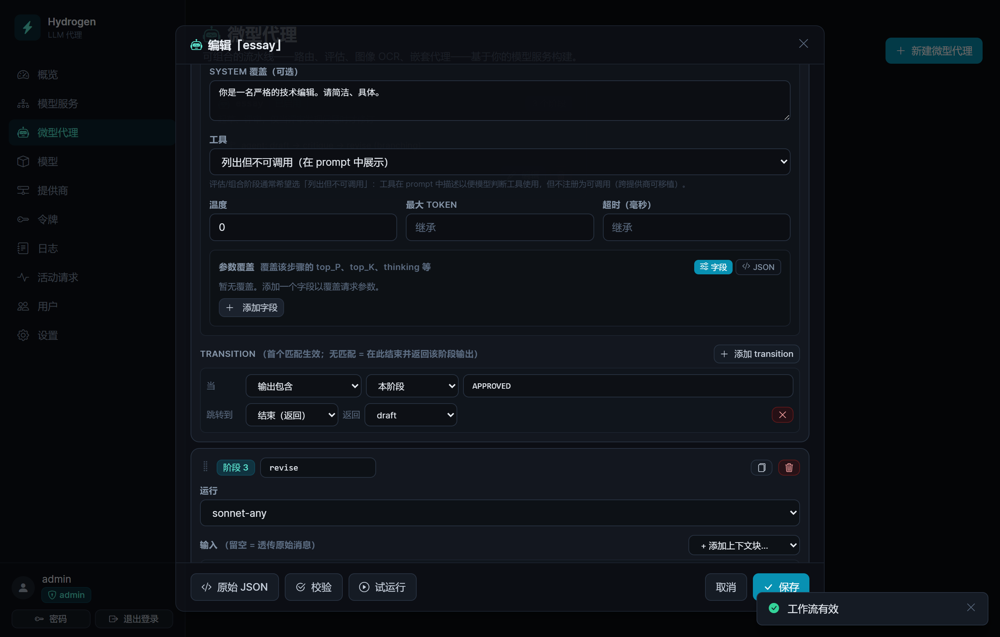

# Hydrogen 上手指南

本文带你从一个刚启动的 Hydrogen 走到第一次成功的 API 调用，然后教你搭建一个**微型代理**——一条多阶段流水线，但客户端调用它时就像调用一个普通模型。

如果只想要最短路径：**提供商 → 模型 → 模型服务 → 令牌 → 调用**。这个顺序不是建议，而是每一步都依赖上一步。

> English version: [getting-started.md](getting-started.md)

---

## 先理解这四个概念

客户端从不指定真实模型。它把 `model` 填成**模型服务**的名字，剩下的由 Hydrogen 决定：

```
客户端请求（model = "sonnet-any"）
        │
   模型服务（Model Service）    有序步骤：先试这个，失败就试那个
        │
   模型（Model）                你自己的名字，如 "sonnet4.6"
        │
   提供商（Provider）           基础 URL + 加密存储的密钥
        │
   上游模型 ID                  提供商实际认的名字，如 "claude-sonnet-4-6"
```

四个概念，各司其职：

| 概念 | 是什么 | 例子 |
|---|---|---|
| **提供商** | 一个上游端点及其 API 密钥 | `openai-official`、`anthropic-official` |
| **模型** | 你给模型起的内部名字 | `sonnet4.6` |
| **映射** | 哪个提供商提供这个模型、用什么 ID | `sonnet4.6 → anthropic-official`，即 `claude-sonnet-4-6` |
| **模型服务** | 客户端请求的名字，以及背后的重试/回退规则 | `sonnet-any` |

这样分层的好处是：换提供商、加回退、改模型，全都只是在控制台上改配置。客户端代码始终只认 `sonnet-any`，完全无感。

---

## 开始之前

你需要一个已经跑起来的 Hydrogen 和一个管理员账号。还没有的话，请先看 [README](../README.md) 的 **Quick start**。打开控制台（默认 `http://localhost:8080`）并登录。

左侧导航就是下文的全部地图：**模型服务**、**微型代理**、**模型**、**提供商**、**令牌**、**日志**、**活动请求**。

> 界面语言可在 **设置 → 界面语言** 切换（仅管理员可改，改完对所有人立即生效）。

---

## 第 1 步 — 添加提供商

**提供商 → 新建提供商。**



| 字段 | 怎么填 |
|---|---|
| **名称** | 你给这个上游起的标签，如 `openai-official`。模型服务靠这个名字引用它。 |
| **类型** | `OpenAI (Chat Completions)`、`OpenAI (Responses API)` 或 `Anthropic`。这是 Hydrogen **对上游**说的协议格式，跟你的客户端说什么格式毫无关系。 |
| **基础 URL** | 见下方说明。 |
| **API 密钥** | 保存的瞬间就用 AES-256-GCM 加密，之后再也不会显示。 |
| **额外请求头（JSON，可选）** | 上游需要额外头时填，如 `{"x-org": "team-a"}`。 |
| **最大输出 token（可选上限）** | 该提供商能接受的硬上限。thinking 预算会被压到这个值以内，避免请求被拒。 |
| **已启用** | 打开。 |

**基础 URL** 取决于类型，弹窗里也会提示会自动追加什么后缀：

- Anthropic → `https://api.anthropic.com`（主机根；会追加 `/v1/messages`）
- OpenAI Chat Completions → `https://api.openai.com/v1`（会追加 `/chat/completions`）
- OpenAI Responses API → `https://api.openai.com/v1`（会追加 `/responses`）

任何 OpenAI 兼容的服务都能接——本地的 Ollama、vLLM、OpenRouter、Groq——选 `OpenAI (Chat Completions)`，基础 URL 指向它的 `/v1` 即可。

保存后提供商会出现在列表里。**立刻点一下「测试」**：它会调用该提供商的模型列表接口并返回「连接正常」，这能在你往上搭任何东西之前就证明基础 URL 和密钥是通的。**密钥**列只显示「已设置」，永远不显示密钥本身。



> **以后再改时：** API 密钥输入框每次打开都是空的。留空表示保持原密钥不变，只有真要换密钥时才填新的。

---

## 第 2 步 — 添加模型并映射

模型只是你目录里的一个名字。真正把它接到提供商上的是**映射**。

**模型 → 新建模型。** 起一个简短、稳定的名字——`sonnet4.6`、`gpt5.4`、`fast-local`。这是**你自己的**名字；上游那串 ID 稍后在映射里填。描述可选。

然后在这个模型的卡片上点**映射提供商**：



- **提供商** — 第 1 步里建的那个。
- **上游模型 ID** — 该提供商在通信时期望的精确字符串，如 `claude-sonnet-4-6` 或 `gpt-4o`。这里写错不会当场报错，而是要等到真正调用时才暴露成上游 404。

当一个模型有多个提供商能提供时（比如 Anthropic 直连 + 一个网关），就把它**映射到多个提供商**。这正是下一步做提供商回退的前提。每条映射显示为一个 `提供商 → 上游 ID` 的小标签：



注意上图里 `sonnet4.6` 挂了两条映射。一个模型、两条路可走——这就是回退链的原材料。

> 一个提供商都没有时点**映射提供商**，会提示「请先创建提供商」。顺序是有要求的。

---

## 第 3 步 — 构建模型服务

这才是客户端真正会用到的名字。

**模型服务 → 新建模型服务。**

| 字段 | 说明 |
|---|---|
| **名称（暴露的模型名）** | 客户端 `model` 里填的就是它，如 `sonnet-any`。 |
| **每次尝试超时（毫秒）** | 是**每一次尝试**的超时，不是整个服务的。默认 60000。 |
| **描述（可选）** | 写给以后的自己看。 |
| **已启用** | 打开。 |
| **可靠流式** | 见下文，先关着。 |

然后搭**失败链**。每个步骤锁定一对明确的**（模型，提供商）**：

- **模型** / **提供商** — 提供商下拉框只会列出你确实映射过的那些。出现`（无已映射提供商）`就说明该回第 2 步了。
- **重试次数** 和 **重试间隔（毫秒）** — 在**本步骤内部**重试，同一个模型、同一个提供商。
- **重试条件** — 哪些失败会触发重试。点选标签（`429`、`499`、`500`、`502`、`503`、`529`、`超时`、`网络`、`错误`），也可以直接输入任意 HTTP 状态码后回车。
- **推进到下一步的条件** — 哪些失败会放弃本步骤、进入下一步。留空表示**任意**失败都推进。选 `已耗尽` 表示「本步骤重试次数用完之后才推进」——「先重试几次，再回退」这个组合通常就是你想要的。

一个不带重试的单步骤服务也是完全合格的模型服务。从这里起步就好。

**所谓加固，其实就是加步骤。** 链条从上往下执行，如果最后一步仍然失败，真实的上游错误会原样返回给客户端：

- **提供商回退** — 同一个模型，换提供商。步骤上的**复制**按钮（⧉）会复制该步并自动切到另一个已映射的提供商，干的就是这件事。
- **模型回退** — 直接换模型。加一个步骤，选另一个模型即可。

下图的 `sonnet-any` 两者都做了，一共三步：先试 `sonnet4.6 @ anthropic-official`（遇到 `429`/`503`/`超时` 重试，`已耗尽`后推进），回退到**同一个模型**在 `bedrock-gateway` 上，最后才彻底放弃 Sonnet、跨厂商切到 `gpt5.4 @ openai-official`。



保存之前，善用底部这几个按钮：

- **校验** — 检查结构，并确认每一对（模型，提供商）都确实映射过。它会打印出上图那条横幅里的大白话摘要：
  `try sonnet4.6@anthropic-official (retry 3× 500ms); else sonnet4.6@bedrock-gateway (retry 2× 500ms); else gpt5.4@openai-official (retry 2x); else fail`。
  把这句读一遍——这是发现「链条跟你想的不一样」的最快办法。
- **试运行** — 真的往上游发一个 `ping`，并告诉你是哪一步扛下来的。密钥填错、上游模型 ID 写错，都是在这一步暴露。
- **原始 JSON** — 同一份定义的文本形态。方便复制粘贴，也能配可视化编辑器没暴露的东西。

> **两个编辑器的重试默认值不一样。** 可视化编辑器里新建的步骤是**1 次尝试、不选任何条件**，也就是不重试。但如果你写原始 JSON 并且**整块省略** `retry`，生效的是服务端默认值：**3 次尝试**，条件为 `429`、`499`、`502`、`503`、`超时`、`网络`。省略不等于留空。

### 关于「可靠流式」

关闭（默认）时，流式请求逐 token 透传——实时，但响应头一旦发出，中途被截断就没法重试了。

打开时，Hydrogen 会流式读取上游、先缓冲完整结果（被截断的流按你的重试规则算作一次可重试的失败），再把完整结果回放给客户端。客户端要么拿到完整响应，要么拿到一个干净的 502，绝不会拿到半截。代价是首 token 延迟变高。无人值守的任务值得开；日常聊天界面通常不需要。

---

## 第 4 步 — 签发令牌

**令牌 → 签发令牌。** 仅管理员可签发，manager 不行。

- **名称** — 如 `my-laptop`。必填。
- **范围** — 默认勾着**允许全部模型服务**。取消勾选后可以只勾特定服务——想给别人一把「只能用便宜那个」的钥匙，就靠它。
- **最大请求数（可选）/ 最大 token 数（可选）** — 这个令牌的配额。
- **过期时间（可选）**。

令牌以 `sk-hproxy-...` 的形式**只显示一次**。请立刻复制：服务器只存哈希，所以之后谁也找不回来，**包括你自己**。丢了就重新签发一个。

---

## 第 5 步 — 调用它

把任意 OpenAI SDK 指向 `http://localhost:8080/v1`，或把任意 Anthropic SDK 指向 `http://localhost:8080`，然后把 `model` 填成你的**模型服务名**。

```bash
# OpenAI 协议
curl http://localhost:8080/v1/chat/completions \
  -H "Authorization: Bearer sk-hproxy-..." \
  -H "content-type: application/json" \
  -d '{"model":"sonnet-any","messages":[{"role":"user","content":"你好"}]}'

# Anthropic 协议 —— 同一个服务，同一批上游
curl http://localhost:8080/v1/messages \
  -H "x-api-key: sk-hproxy-..." \
  -H "anthropic-version: 2023-06-01" \
  -H "content-type: application/json" \
  -d '{"model":"sonnet-any","max_tokens":256,"messages":[{"role":"user","content":"你好"}]}'
```

客户端的协议和提供商的协议是彼此独立的。说 Anthropic 协议的客户端完全可以由 OpenAI 提供商来服务，反之亦然——Hydrogen 双向翻译。

| 方法 | 路径 |
|---|---|
| POST | `/v1/chat/completions` |
| POST | `/v1/responses` |
| POST | `/v1/messages` |
| POST | `/v1/embeddings` |
| GET | `/v1/models` — 列出你的模型服务（带 `anthropic-version` 头时返回 Anthropic 格式） |

因为 `/v1/models` 返回的就是模型服务，所以那些会自动拉取模型列表的工具，下拉框里显示的就是你的服务名。这正是设计意图：对任何客户端而言，`sonnet-any` **就是**模型本身。

## 第 6 步 — 观察它

**日志**记录每一次请求：走的哪个服务、尝试了哪些步骤、状态码、耗时、token 用量，以及请求/响应负载。回退真正触发的时候，就是在这里看到的。**活动请求**显示当前正在进行中的请求。

---

# 进阶 — 搭一个微型代理

上面所有内容都是把**一个**请求路由到**一次**上游调用。而**微型代理**会跑**多次**模型调用（称为阶段），但对客户端仍然只表现为一个模型名。

正因为在外界看来微型代理**就是**一个模型服务，它不需要客户端做任何改造。你把现有应用的 `model` 从 `sonnet-any` 换成 `essay`，它就自动获得了「起草—评审—修订」的能力。微型代理还能作为阶段嵌套进另一个微型代理里。

**微型代理 → 新建微型代理。**



外壳跟模型服务一模一样——名称、超时、校验、试运行、原始 JSON——只是主体从失败链换成了**阶段**列表，摘要那行写着 `agent: draft → critique → revise (branching)`。

## 微型代理是怎么跑的

阶段**从上往下**执行。每跑完一个阶段，就按顺序检查它的 **transition**，第一个匹配的生效。没有匹配就落到下一个阶段；一路跑到底就结束。默认返回「停在哪个阶段，就返回哪个阶段的输出」。

有两条规则决定了所有设计：

- **transition 只能向前。** 可以往后跳，但绝不能往回跳。因此不存在循环——定长流水线一定会终止。往回跳的 `goto` 会被校验直接拒绝。
- **每个阶段运行的是一个已保存的模型服务**（或另一个微型代理），所以每个阶段都白嫖了那个服务的重试与回退规则。加固只做一次，处处复用。

## 完整示例：draft → critique → revise

最经典的质量流水线：先写答案，用便宜模型挑毛病，只有挑出毛病时才修订。假设你已经有两个模型服务：`sonnet-any`（好的）和 `fast-cheap`（快的）。

**阶段 1 — `draft`**
- **运行：** `sonnet-any`
- **输入：** *留空* —— 原始消息原样透传，跟客户端发来的一模一样。

**阶段 2 — `critique`**
- **运行：** `fast-cheap`
- **输入：** 三个上下文块，按顺序排列——你的 prompt 就是在这里拼出来的：
  1. `仅最后一条用户文本` —— 用户最初问的是什么
  2. `来自其他阶段的输出` → `draft`，作为**助手**
  3. `新对话轮次`（用户）：*「对照上面的请求评审这个回答。如果它已经正确且完整，只回复 APPROVED，不要输出任何其他内容。否则逐行列出具体问题。」*
- **高级 → system 覆盖：** *「你是一名严格的技术编辑。请简洁、具体。」*
- **高级 → 工具：** `列出但不可调用（在 prompt 中展示）` —— 原因见下文。
- **高级 → 温度：** `0`
- **transition：** 当**输出包含** `APPROVED` → 跳到**结束（返回）**，返回 **`draft`**。

三个上下文块按顺序摞起来——这就是整个 prompt，纯手工拼装：



分支本身读起来几乎就是一句话——*当输出包含 `APPROVED`，跳到结束，返回 `draft`*：



**阶段 3 — `revise`**
- **运行：** `sonnet-any`
- **输入：**
  1. `仅最后一条用户文本`
  2. `来自其他阶段的输出` → `draft`，作为**助手**
  3. `新对话轮次`（用户）：*「评审提出了以下问题：」*
  4. `来自其他阶段的输出` → `critique`，作为**用户**
  5. `新对话轮次`（用户）：*「重写你的回答，解决其中每一个问题。只返回重写后的回答。」*

如果评审说了 `APPROVED`，代理就停在阶段 2 并返回 **draft**——注意返回的是阶段 1 的正文，而不是「APPROVED」这个词。否则就落到 `revise`，而它是最后一个阶段，所以它的输出就是客户端拿到的东西。两条路径下，客户端看到的都只是一个普通响应。

下面是同一个代理的**原始 JSON**，贴进编辑器的「原始 JSON」标签页就能省掉所有点击：

```json
{
  "kind": "micro_agent",
  "timeoutMs": 120000,
  "stages": [
    {
      "name": "draft",
      "service": "sonnet-any",
      "input": []
    },
    {
      "name": "critique",
      "service": "fast-cheap",
      "input": [
        { "kind": "last_user_text" },
        { "kind": "stage_output", "stage": "draft", "role": "assistant" },
        {
          "kind": "message",
          "role": "user",
          "text": "对照上面的请求评审这个回答。如果它已经正确且完整，只回复 APPROVED，不要输出任何其他内容。否则逐行列出具体问题。"
        }
      ],
      "tools": "none",
      "system": "你是一名严格的技术编辑。请简洁、具体。",
      "temperature": 0,
      "transitions": [
        { "when": { "type": "output_contains", "value": "APPROVED" }, "goto": "end", "output": "draft" }
      ]
    },
    {
      "name": "revise",
      "service": "sonnet-any",
      "input": [
        { "kind": "last_user_text" },
        { "kind": "stage_output", "stage": "draft", "role": "assistant" },
        { "kind": "message", "role": "user", "text": "评审提出了以下问题：" },
        { "kind": "stage_output", "stage": "critique", "role": "user" },
        { "kind": "message", "role": "user", "text": "重写你的回答，解决其中每一个问题。只返回重写后的回答。" }
      ]
    }
  ]
}
```

点**校验**，再**保存**。给它签发一个令牌（或者用「允许全部模型服务」的令牌），然后直接按名字调用：

```bash
curl http://localhost:8080/v1/chat/completions \
  -H "Authorization: Bearer sk-hproxy-..." \
  -H "content-type: application/json" \
  -d '{"model":"essay","messages":[{"role":"user","content":"给应届生讲讲 B 树。"}]}'
```

然后打开**日志**展开这条记录。每个阶段都是一次独立的调用，各自带着自己的尝试记录、负载和 token 用量，全都嵌套在这一条客户端请求下面。想搞清楚「代理为什么这么干」，就靠它。

## 拼装阶段的输入

**输入**列表**就是**prompt 工程本身。留空，阶段收到的就是原封不动的原始对话；一旦加了块，你就是在亲手按顺序拼消息：

| 上下文块 | 贡献什么 |
|---|---|
| `原始完整对话` | 客户端发来的每一条消息，原样。 |
| `仅文本对话` | 同上，但去掉图片。 |
| `最后一条用户请求` | 只要最近的那条用户消息（文本 + 图片）。 |
| `仅最后一条用户文本` / `仅最后一条用户图片` | 只要其中一半。 |
| `来自其他阶段的输出` | 把某个更早阶段的输出注入进来，作为**助手**或**用户**。 |
| `新对话轮次` | 你自己写的固定指令，可作为用户或助手。 |
| `工具使用轮次` | 一对伪造的工具调用 + 结果，用来预置「像是用过工具」的上下文。 |

只能引用**更早的**阶段——校验会强制这一点。相邻且角色相同的块会合并成一条消息，所以连续几个用户块最终会变成一条用户消息。

**关于「工具」设置：** `继承——可调用` 保持客户端的工具可被调用。`列出但不可调用（在 prompt 中展示）` 则把工具定义渲染进 system prompt 作为参考，但并不真正注册它们——评估/合成类的阶段通常要的就是这个。评审者应该能**判断**一次工具调用，而不是自己去调；而且这也是可移植的选择，因为 `tool_choice: "none"` 被很多提供商拒绝。

## 路由器：不花钱也能分支

把阶段的**运行**设为 `路由器（无模型调用——仅按输入路由）`，这个阶段就完全不调用模型。它只是拿原始输入去评估自己的 transition 然后跳转。把它放在最前面，就能把琐碎请求送上廉价路径：

```
阶段 1  triage（路由器）   当 输入匹配（正则） ^\s*(你好|谢谢|hi|hello)   → 跳到 quick
                           （无匹配 → 落到 draft）
阶段 2  quick              总是 → 结束（返回）
阶段 3  draft   …
```

`quick` 必须带上那条 `总是 → 结束（返回）`。否则它会继续落进 `draft`，昂贵路径照样要花钱。

可用的条件有：`总是`、`输入含图片`、`输入包含`、`输入匹配（正则）`、`输出包含`、`输出匹配（正则）`。

> **正则的坑：** 正则是按普通 JavaScript `RegExp` 编译的，且不带任何 flag。像 `(?i)` 这样的内联 flag 是语法错误，而无效的正则会**静默地永不匹配**——所以 `(?i)hello` 这个条件根本不会触发。请改用 `[Hh]ello`。**校验**会在保存时就拒绝无效正则，那正是发现它的时机。

## 图片转文本（OCR）

打开**将图片转为文本（OCR 预处理）**，就会在阶段 1 之前先跑一个多模态模型服务。请求里的每张图片都会被转录成文本并就地替换，于是后续所有阶段——包括纯文本模型——收到的都是纯文本对话。内置 prompt 已经能处理多张图片并返回结构化结果，高级面板里可以替换它。OCR 这一步只能是普通的模型服务，不能是另一个微型代理。

## 依赖它之前，先知道这些

- **流式是缓冲的。** 路由需要每个阶段的完整输出，所以代理总是先整个跑完，再把结果按节奏回放成流。客户端拿到的仍是正常的 SSE 流，只是首 token 等得更久。
- **成本是乘法。** 三个阶段就是三次计费调用。响应上报告的 token 用量是**所有阶段之和**，所以账目是诚实的。
- **超时是每次尝试的，不是整个代理的。** 代理自己的 `timeoutMs` 只是各阶段继承的默认值，阶段可以覆盖它。一个五阶段的代理跑上几分钟完全合理——请相应放大客户端的超时。
- **允许嵌套**，最深 8 层；成环会在运行时被检测并拒绝，而不是无限循环。
- **任何一个阶段失败，整个代理就失败。** 没有「出错继续」这种选项——把加固放进每个阶段所运行的那个模型服务里，那本来就是模型服务的职责。

---

## 排查

| 你看到的 | 意味着什么 |
|---|---|
| 步骤的提供商下拉框里是`（无已映射提供商）` | 这个模型还没做映射。去 模型 → **映射提供商**。 |
| 校验报「These (model, provider) pairs are not mapped in the catalog」 | 步骤指向了一对并不存在的组合。改映射，或改步骤。 |
| 试运行返回 401/403 | 提供商的 API 密钥不对。重新填一遍（留空 = 保持原值，所以必须真的把新密钥打进去）。 |
| 试运行返回 404 | 映射里的**上游模型 ID** 不是该提供商认的那个名字。 |
| 客户端收到 Hydrogen 的 401 | 令牌错误或已吊销，又或者该令牌的范围不包含这个服务。 |
| 客户端收到模型 404 | 你发的 `model` 不是一个模型服务名，或者该服务被禁用了。 |
| 提示「请先创建提供商」 | 提供商 → 模型 → 映射，就是这个顺序。 |
| 代理报「references unknown Model Service or Micro Agent」 | 某个阶段引用了不存在的服务。先把那个模型服务存下来。 |
| 代理报「transition goto ... must be a later stage」 | transition 只能向前。请改成调整阶段顺序。 |
| Hydrogen 拒绝启动 | `PROXY_MASTER_KEY` 变了，跟已加密的密钥对不上。见 [README](../README.md) 的 **Security notes**。 |
